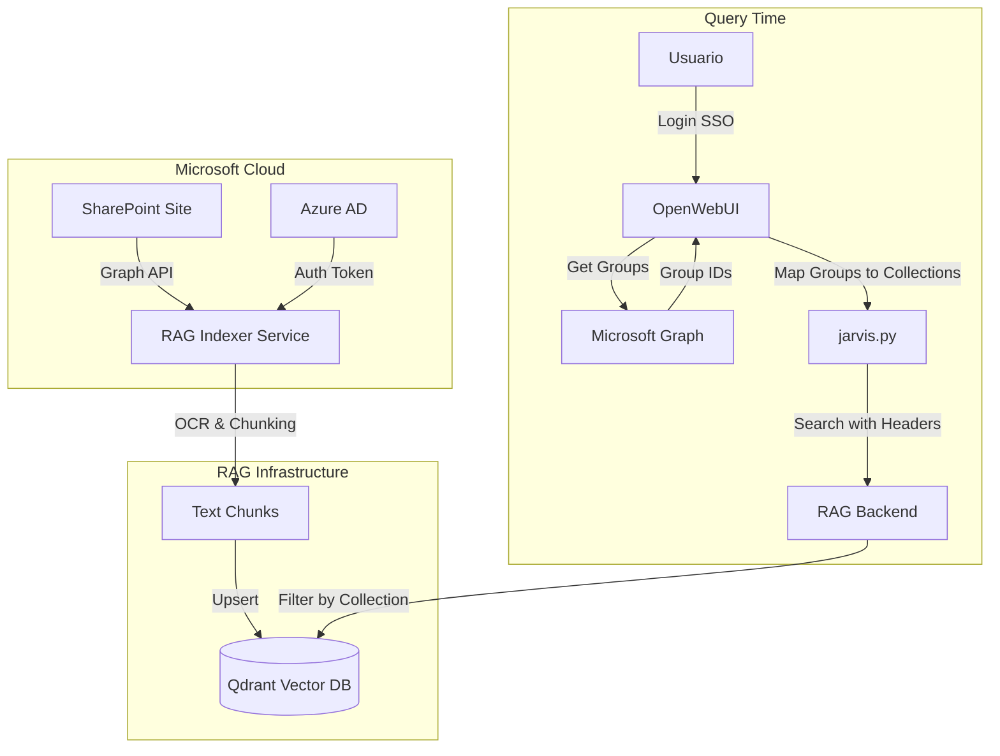

# 🦅 SharePoint RAG Integration Guide

**Destinatarios**: Administradores de Sistemas, DevOps, Arquitectos.  
**Propósito**: Guía definitiva para conectar sitios de SharePoint, gestionar permisos y entender la arquitectura de seguridad del RAG.  
**Estado**: Documentación de referencia (no implementado en el despliegue base).

---

## 📖 Índice

1. [Arquitectura de Integración](#1-arquitectura-de-integración)
2. [Gestión de Permisos](#2-gestión-de-permisos-paso-a-paso)
3. [Añadir Nuevo Sitio SharePoint](#3-cómo-añadir-un-nuevo-sitio-de-sharepoint)
4. [SSO con Azure AD](#4-sso-con-azure-ad-en-openwebui)
5. [Troubleshooting](#5-troubleshooting-común)

---

## 🏗️ 1. Arquitectura de Integración

La integración entre SharePoint y el RAG no es mágica; sigue un flujo estricto de seguridad para garantizar que **cada usuario solo vea lo que tiene permitido ver**.

### 1.1 Diagrama de Flujo de Datos



### 1.2 Conceptos Clave

| Concepto | Descripción |
|----------|-------------|
| **Colecciones de Qdrant** | Cada departamento o sitio de SharePoint se indexa en una **colección separada** dentro de Qdrant. Ejemplo: `documents` (Global), `documents_CIVEX2`, `documents_CALIDAD`. |
| **Mapeo de Grupos** | El pipeline `jarvis.py` actúa como "Portero". Cuando un usuario pregunta, consulta sus grupos de Azure AD y usa una tabla de mapeo (`DEPARTMENT_MAPPING`) para traducir "Grupo Azure → Colección Qdrant". |
| **Pre-filtering** | El backend **nunca** busca en todas las colecciones. Solo busca en las colecciones que el pipeline le indica explícitamente en los headers (`X-Tenant-Ids`). |

### 1.3 Flujo de Seguridad

```
1. Usuario hace login → OpenWebUI valida con Azure AD
2. Azure AD devuelve token con grupos del usuario
3. Pipeline lee grupos del token
4. Pipeline traduce grupos → colecciones permitidas
5. Backend busca SOLO en esas colecciones
6. Usuario ve SOLO sus documentos autorizados
```

---

## 🔐 2. Gestión de Permisos (Paso a Paso)

El control de acceso se basa en **Grupos de Seguridad de Azure AD**.

### 2.1 Dar acceso a un usuario a "CIVEX2"

1. **En Azure Portal**:
   - Ir a **Active Directory** → **Groups**.
   - Buscar el grupo correspondiente a CIVEX2 (ej. `CIVEX2_RAG_Users`).
   - Añadir el correo del usuario a este grupo.

2. **En el Sistema RAG (Verificación)**:
   - El usuario hace login en OpenWebUI.
   - El pipeline `jarvis.py` detecta sus grupos.
   - Automáticamente le da acceso a la colección `documents_CIVEX2`.

### 2.2 Investigando IDs de Grupos (Graph Explorer)

Para encontrar el **Object ID** de un grupo de SharePoint/Teams:

1. Accede a **[Graph Explorer](https://developer.microsoft.com/en-us/graph/graph-explorer)** e inicia sesión con tu cuenta corporativa.
2. Usa la siguiente consulta GET para buscar grupos por nombre:
   ```http
   https://graph.microsoft.com/v1.0/groups?$filter=startswith(displayName,'NombreDelGrupo')&$select=id,displayName
   ```
3. Copia el valor de `id` de la respuesta JSON. Ese es el ID que debes poner en `jarvis.py`.

### 2.3 Investigando IDs de Sitios (Reverse Lookup)

Si tienes un **Site ID** (ej. `tuempresa.sharepoint.com,XXXXXXXX-XXXX,YYYYYYYY-YYYY...`) y quieres saber a qué sitio web corresponde:

1. Abre **[Graph Explorer](https://developer.microsoft.com/en-us/graph/graph-explorer)**.
2. Haz una petición GET a:
   ```http
   https://graph.microsoft.com/v1.0/sites/{SITE_ID_AQUI}
   ```
   *(Pega el ID completo con las comas)*
3. En la respuesta JSON, busca el campo **`webUrl`**. Esa es la dirección del sitio.

### 2.4 Añadir un NUEVO grupo de permisos

Imagina que creamos un sitio nuevo "Recursos Humanos".

**Paso 1: Crear Grupo en Azure AD**
- Crear grupo `RRHH_RAG_Access`.
- **Copiar el Object ID** del grupo (ej. `XXXXXXXX-XXXX-XXXX-...`).

**Paso 2: Actualizar el Mapeo en el Pipeline**
Editar archivo: `services/openwebui/pipelines/jarvis.py`

```python
DEPARTMENT_MAPPING: Dict[str, str] = {
    # NUEVO GRUPO
    "XXXXXXXX-XXXX-XXXX-...": "documents_RRHH",  # Object ID -> Colección
    "RRHH_RAG_Access": "documents_RRHH"           # Nombre -> Colección (opcional)
}
```

**Paso 3: Reiniciar OpenWebUI**
```powershell
docker restart tfg-openwebui
```

---

## 🚀 3. Cómo Añadir un Nuevo Sitio de SharePoint

Para que el RAG ingeste documentos de un nuevo sitio de SharePoint, necesitamos configurar un nuevo **Indexer**.

### Prerrequisitos
- **Site ID** de SharePoint.
- **Drive ID** (Biblioteca de documentos) si no es la default.
- **Permisos de Lectura** para la App Registration en ese sitio.

### Paso 1: Obtener IDs de SharePoint

La forma más fácil es usar el Graph Explorer:
```http
GET https://graph.microsoft.com/v1.0/sites/{hostname}:/sites/{site-path}
```
Esto devuelve el `id` del sitio.

### Paso 2: Configurar Docker Compose

Editar `docker-compose.yml`:

```yaml
  # NUEVO INDEXER PARA RRHH
  tfg-indexer-rrhh:
    build:
      context: ./services/indexer
    container_name: tfg-indexer-rrhh
    environment:
      COLLECTION_NAME: documents_RRHH      # <-- Nombre de la nueva colección
      SHAREPOINT_SITE_ID: ${RRHH_SITE_ID}  # ID del sitio RRHH
      SHAREPOINT_FOLDER_PATH: General      # Carpeta a indexar
      AZURE_TENANT_ID: ${AZURE_TENANT_ID}
      AZURE_CLIENT_ID: ${AZURE_CLIENT_ID}
      AZURE_CLIENT_SECRET: ${AZURE_CLIENT_SECRET}
      BACKEND_URL: http://tfg-backend:8002
    depends_on:
      - qdrant
      - tfg-backend
    networks:
      - tfg-network
```

### Paso 3: Desplegar

```powershell
docker compose up -d tfg-indexer-rrhh
```

El indexer comenzará a:
1. Conectarse a SharePoint.
2. Descargar PDFs.
3. Hacer chunking con OCR.
4. Crear la colección `documents_RRHH` en Qdrant (si no existe).
5. Indexar los vectores.

---

## 🔑 4. SSO con Azure AD en OpenWebUI

Para habilitar el inicio de sesión único con cuentas corporativas de Microsoft:

### 4.1 Crear App Registration en Azure

1. Azure Portal → **App registrations** → **New registration**
2. Nombre: `OpenWebUI SSO`
3. Redirect URI: `https://tu-dominio.com/oauth/oidc/callback`
4. Copiar:
   - **Application (client) ID**
   - **Directory (tenant) ID**
5. Crear un **Client Secret** y copiarlo.

### 4.2 Configurar OpenWebUI

En `docker-compose.yml`, añadir al servicio `openwebui`:

```yaml
environment:
  ENABLE_OAUTH_SIGNUP: "true"
  OAUTH_PROVIDER: oidc
  OPENID_PROVIDER_URL: https://login.microsoftonline.com/${AZURE_TENANT_ID}/v2.0/.well-known/openid-configuration
  OAUTH_CLIENT_ID: ${AZURE_CLIENT_ID}
  OAUTH_CLIENT_SECRET: ${AZURE_CLIENT_SECRET}
  OAUTH_SCOPES: openid profile email
  OPENID_REDIRECT_URI: https://tu-dominio.com/oauth/oidc/callback
```

### 4.3 Permisos de Graph API

Para que el sistema pueda leer los grupos del usuario, la App Registration necesita:
- `User.Read` (Delegated)
- `GroupMember.Read.All` (Application) - Para leer grupos

---

## ❓ 5. Troubleshooting Común

### El usuario dice "No veo los documentos de CIVEX2"

1. **Check Azure**: ¿Está el usuario en el grupo de Azure AD correcto?
2. **Check Pipeline Logs**:
   ```powershell
   docker logs tfg-pipelines | grep -i "groups"
   ```
   - Buscar: `DEBUG groups encontrados: [...]`
   - Buscar: `Usuario {email} tiene acceso a: [...]`
   - Si el grupo aparece pero no la colección, falta actualizar `DEPARTMENT_MAPPING`.

### El Indexer da error "403 Forbidden"

1. La **App Registration** necesita permisos `Sites.Selected` o `Sites.Read.All` en Graph API.
2. Si usas `Sites.Selected`, debes haber añadido explícitamente permiso a la App sobre ESE sitio vía PowerShell:
   ```powershell
   # Ejemplo PowerShell para dar permiso a una App sobre un sitio
   # Requiere módulo PnP.PowerShell
   Connect-PnPOnline -Url "https://tenant.sharepoint.com/sites/MiSitio" -Interactive
   Grant-PnPAzureADAppSitePermission -AppId "app-client-id" -DisplayName "RAG Indexer" -Permissions Read
   ```

### Duplicidad de Documentos

- Si cambias el nombre de un archivo en SharePoint, el sistema lo trata como nuevo.
- El indexer usa `id` de SharePoint para evitar duplicados, pero si borras y resubes, se reindexa.

### SSO no funciona

1. Verificar que la Redirect URI en Azure coincide **exactamente** con la configurada.
2. Verificar que el Client Secret no ha expirado.
3. Revisar logs de OpenWebUI: `docker logs tfg-openwebui | grep -i oauth`

---

## 📚 Referencias

- [Microsoft Graph API Documentation](https://docs.microsoft.com/en-us/graph/)
- [OpenWebUI OAuth Configuration](https://docs.openwebui.com/features/authentication)
- [PnP PowerShell for SharePoint](https://pnp.github.io/powershell/)

---

*Documento generado para TFG - Universidad Rey Juan Carlos*
