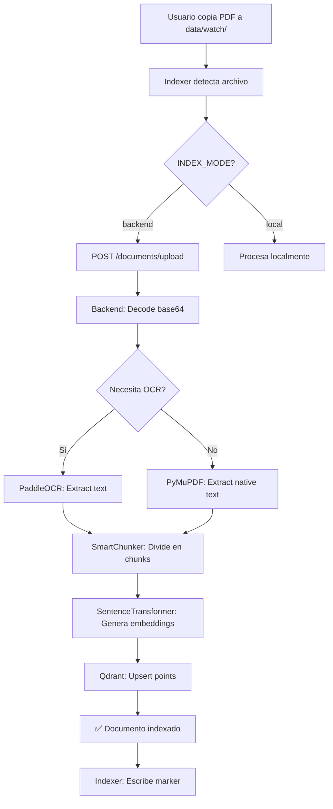
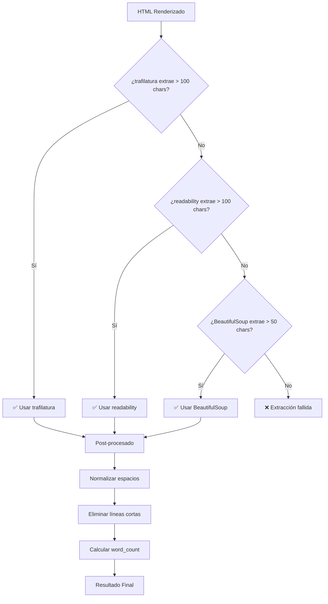

# 🛠️ Arquitectura Técnica - JARVIS RAG System

**Para**: Desarrolladores, Arquitectos, Administradores de Sistemas  
**Versión**: 3.9  
**Proyecto**: TFG - Universidad Rey Juan Carlos  
**Nivel**: Técnico

---

## 📖 Índice

1. [Vista General de Arquitectura](#vista-general-de-arquitectura)
2. [Componentes Detallados](#componentes-detallados)
3. [Flujos de Datos](#flujos-de-datos)
4. [Stack Tecnológico](#stack-tecnológico)
5. [Modelos de Datos](#modelos-de-datos)
6. [Seguridad y Autenticación](#seguridad-y-autenticación)
7. [Escalabilidad](#escalabilidad)
8. [Decisiones de Diseño](#decisiones-de-diseño)
9. [Sincronización SharePoint](#sincronización-sharepoint)
10. [Monitorización (Grafana + Prometheus)](#monitorización-grafana--prometheus)
11. [Memoria Conversacional](#memoria-conversacional)
12. [Gestión de Memoria Web](#122-prevención-de-duplicados-data-integrity)
13. [Operaciones y Mantenimiento](#13-operaciones-y-mantenimiento)
14. [Integración BOE (Boletín Oficial del Estado)](#14-integración-boe-boletín-oficial-del-estado) 🆕
15. [Web Scraping Recursivo](#15-web-scraping-recursivo) 🆕

---

## 🏗️ Vista General de Arquitectura

### Arquitectura de Capas

```
┌─────────────────────────────────────────────────────────────┐
│                    CAPA DE PRESENTACIÓN                      │
│  ┌──────────────┐        ┌──────────────┐                   │
│  │  OpenWebUI   │◄───────┤    Nginx     │ (Reverse Proxy)   │
│  │  (React/TS)  │        │              │                    │
│  └──────┬───────┘        └──────────────┘                    │
└─────────┼────────────────────────────────────────────────────┘
          │
┌─────────┼────────────────────────────────────────────────────┐
│         │         CAPA DE ORQUESTACIÓN                        │
│  ┌──────▼───────────┐                                         │
│  │  Pipelines       │ ◄── JARVIS (Python)       │
│  │  (Python Server) │     - Detección de intención           │
│  └───────┬──────────┘     - Routing inteligente              │
└──────────┼─────────────────────────────────────────────────────┘
           │
┌──────────┼─────────────────────────────────────────────────────┐
│          │            CAPA DE APLICACIÓN                        │
│  ┌───────▼──────┐   ┌──────────────┐   ┌──────────────┐       │
│  │   Backend    │   │   Indexer    │   │   LiteLLM    │       │
│  │   (FastAPI)  │   │   (FastAPI)  │   │   (Proxy)    │       │
│  └───┬──────┬───┘   └──────┬───────┘   └──────┬───────┘       │
└──────┼──────┼──────────────┼──────────────────┼────────────────┘
       │      │              │                  │
┌──────┼──────┼──────────────┼──────────────────┼────────────────┐
│      │      │              │                  │                 │
│  ┌───▼──┐ ┌▼────┐   ┌─────▼─────┐      ┌────▼─────┐   CAPA   │
│  │Qdrant│ │Redis│   │ PostgreSQL│      │  Ollama  │   DE     │
│  │Vector│ │Cache│   │ (Memory)  │      │  (LLMs)  │   DATOS  │
│  └──────┘ └─────┘   └───────────┘      └──────────┘           │
└────────────────────────────────────────────────────────────────┘
```

### Flujo de Request Típico (RAG)

```sequence
Usuario → OpenWebUI: "¿Qué dice la política de calidad?"
OpenWebUI → Pipeline: Forward message
Pipeline → Pipeline: Detect intent = "rag"
Pipeline → Backend: POST /chat {mode: "rag"}
Backend → Qdrant: Search vectors("política calidad")
Qdrant → Backend: Top 5 chunks [relevance scores]
Backend → LiteLLM: Generate with context
LiteLLM → Ollama: POST /v1/chat/completions
Ollama → Ollama: llama3.1 inference
Ollama → LiteLLM: Response text
LiteLLM → Backend: Response
Backend → Backend: Format + add sources
Backend → Pipeline: {content, sources[]}
Pipeline → OpenWebUI: Formatted response
OpenWebUI → Usuario: Rendered chat + sources
```

### Flujo de Archivo Adjunto en Chat (FILE_CHAT)

> ⚠️ **Importante**: Este flujo es 100% local, no pasa por el backend RAG.

```sequence
Usuario → OpenWebUI: Sube PDF + "resume esto"
OpenWebUI → OpenWebUI: Extrae texto del PDF
OpenWebUI → Pipeline: {content: "<source>...texto...</source>", message: "resume"}
Pipeline → Pipeline: _has_file_attachment() = True
Pipeline → Pipeline: Detect intent = "file_chat"
Pipeline → Ollama: POST /api/generate (DIRECTO, no LiteLLM)
Ollama → Ollama: llama3.1:8b-instruct-q8_0
Ollama → Pipeline: Respuesta sobre el documento
Pipeline → OpenWebUI: Respuesta formateada
```

**Características**:
- ✅ **100% Local**: No toca el backend RAG ni busca en documentos indexados
- ✅ **Ollama Directo**: Bypass de LiteLLM para mayor control
- ✅ **Contexto Grande**: `num_ctx=8192` para documentos largos
- ⚠️ **Limitación OCR**: Ver sección abajo

### ⚠️ Limitación: PDFs Escaneados en Chat

Cuando se sube un PDF **escaneado** (sin texto seleccionable) directamente en el chat:

| Caso | Qué pasa | Solución |
|------|----------|----------|
| PDF con texto | OpenWebUI extrae el texto → funciona ✅ | - |
| PDF escaneado | OpenWebUI no puede extraer texto → falla ❌ | Usar carpeta `data/watch` |
| Imagen directa | Pipeline detecta imagen → OCR con qwen2.5vl ✅ | - |

**Solución para PDFs escaneados**:
1. Colocar el PDF en `data/watch/`
2. El **Indexer** lo procesará con **PaddleOCR**
3. Luego consultar via RAG: "resume el documento X"

---

## 🧩 Componentes Detallados

### 1. Backend (tfg-backend)

**Tecnología**: FastAPI + Uvicorn  
**Puerto**: 8002  
**Lenguaje**: Python 3.11  
**Responsabilidades**: Core logic, RAG, OCR, Web scraping

#### Estructura Interna (v3.9 — Arquitectura Modular)

> [!NOTE]
> En v3.9, `main.py` fue refactorizado de 1959 a ~295 líneas. La lógica de negocio se distribuyó en módulos especializados.

```
backend/app/
├── main.py                      # Orquestador: config, middleware, routers, lifecycle
├── state.py                     # Estado global (AppState) + configuración desde .env
├── metrics.py                   # Métricas Prometheus centralizadas
│
├── schemas/                     # Modelos Pydantic (request/response)
│   ├── chat.py                 # ChatRequest, ChatResponse
│   ├── documents.py            # DocumentUploadRequest, SearchRequest, DocumentList
│   └── webhooks.py             # SharePointWebhookPayload
│
├── services/                    # Lógica de negocio (sin HTTP)
│   ├── mode_detector.py        # Detección inteligente de modo (URL/web/RAG/chat)
│   ├── chat_service.py         # Scrape, web search, RAG context building
│   └── cache.py                # Caché Redis para resultados RAG
│
├── api/                         # Routers HTTP (endpoints)
│   ├── chat.py                 # POST /chat, POST /chat/stream (SSE)
│   ├── documents_endpoints.py  # CRUD documentos + process_document
│   ├── webhooks.py             # Webhook SharePoint
│   ├── system.py               # /health, /, /metrics
│   ├── search.py               # Hybrid search (v2.0)
│   ├── scrape.py               # Web scraping (Playwright)
│   ├── web_search.py           # DuckDuckGo search
│   └── external_data.py        # BOE integration
│
├── core/
│   ├── rag/
│   │   └── retriever.py        # RAGRetriever class
│   ├── retrieval.py            # HybridRetriever (dense+sparse)
│   ├── query_processor.py     # QueryProcessor (intent, keywords)
│   ├── memory/
│   │   └── manager.py          # MemoryManager (Postgres)
│   └── agent/
│       └── base.py             # RAGAgent (legacy, no usado)
├── processing/
│   ├── ocr/
│   │   └── paddle_ocr.py       # OCRPipeline (PaddleOCR+GPU)
│   ├── chunking/
│   │   └── smart_chunker.py    # SmartChunker (semantic)
│   └── embeddings/
│       └── sentence_transformer.py  # SentenceTransformer
└── integrations/
    ├── sharepoint/
    │   ├── client.py           # SharePointClient (MSAL)
    │   └── synchronizer.py     # Delta sync
    └── scraper/
        ├── playwright_scraper.py   # Browser automation
        └── content_extractor.py    # Trafilatura + fallbacks
configs/
└── sharepoint_sites.json       # Multi-site configuration
```

#### Middleware (v3.9)

| Middleware | Descripción | Configuración |
|-----------|-------------|---------------|
| **CORS** | Cross-Origin Resource Sharing | `CORS_ALLOW_ORIGINS` env var |
| **Rate Limiting** | Protección contra abuso (slowapi) | `RATE_LIMIT` env var (default: `60/minute`) |
| **Prometheus Metrics** | Métricas HTTP (requests, duración) | Automático (excluye /metrics, /docs) |

#### Endpoints Principales

| Endpoint | Método | Descripción | Request | Response |
|----------|--------|-------------|---------|----------|
| `/chat` | POST | Chat RAG con memoria | `ChatRequest` | `ChatResponse` |
| `/chat/stream` | POST | Chat con streaming SSE | `ChatRequest` | `text/event-stream` |
| `/api/v1/search` | POST | Búsqueda híbrida | `SearchRequest` | `SearchResponse` |
| `/web-search` | GET | Buscar en DuckDuckGo | `q` (query param) | `WebSearchResponse` |
| `/scrape` | POST | Scrapear URL (a colección `webs`) | `{url, mode}` | `{status}` |
| `/documents/upload` | POST | Subir documento | `{filename, content_base64}` | `{status}` |
| `/documents/list` | GET | Listar documentos | - | `{total, documents[]}` |
| `/documents/stats` | GET | Stats de Qdrant | - | `{points_count}` |
| `/health` | GET | Health check | - | `{status, components}` |

#### Modelos Pydantic

**ChatRequest**:
```python
class ChatRequest(BaseModel):
    message: str = Field(..., min_length=1, max_length=4001)
    conversation_id: Optional[int] = None
    user_id: Optional[int] = None
    azure_id: Optional[str] = None
    email: Optional[str] = None
    name: Optional[str] = None
    mode: str = "chat"  # "chat" | "rag" | "ocr"
```

**ChatResponse**:
```python
class ChatResponse(BaseModel):
    content: str
    sources: List[dict]
    conversation_id: int
    has_citations: bool
    tokens_used: int
    processing_time: float
```

#### RAG Pipeline Interno

```python
# Flujo en /chat endpoint (mode="rag")
1. retriever.retrieve(query, top_k=5)
   │
   ├─> Embed query con SentenceTransformer
   ├─> Search en Qdrant (vector similarity)
   └─> Returns: List[SearchResult]

2. Construir contexto
   context = "\n\n".join([
       f"[{r.filename} | score={r.score}]\n{r.text}"
       for r in results
   ])

3. Llamar LLM
   llm_client.chat.completions.create(
       model="llama3.1",
       messages=[
           {"role": "system", "content": system_prompt},
           {"role": "user", "content": f"{context}\n\n{query}"}
       ]
   )

4. Format response
   {
       "content": llm_response,
       "sources": [{"filename": ..., "page": ..., "score": ...}]
   }
```

#### 🌐 Web Search (Búsqueda en Internet)

**Endpoint**: `/web-search`  
**Archivo**: `backend/app/api/web_search.py`  
**Método**: GET  
**Parámetro**: `q` (query string)

El sistema permite búsquedas en Internet usando DuckDuckGo, con fallback automático a HTML scraping cuando la librería principal falla (rate limiting).

**Arquitectura de Fallback**:

```
┌─────────────────────────────────────────────────────────────────┐
│                    Web Search Pipeline                           │
├─────────────────────────────────────────────────────────────────┤
│  1. Recibe query (ej: "significado nombre Orla")                │
│                         │                                        │
│  2. ¿Necesita info fresca? (fichajes, noticias, precios, etc.) │
│     │                                                            │
│     ├─ SÍ → Añade año actual al query                           │
│     │       + Combina resultados web + noticias                 │
│     │                                                            │
│     └─ NO → Búsqueda normal                                     │
│                         │                                        │
│  3. Intentar librería DDGS (duckduckgo_search)                  │
│     │                                                            │
│     ├─ ÉXITO → Devuelve resultados                              │
│     │                                                            │
│     └─ FALLO/VACÍO → Fallback a HTML scraping                  │
│                         │                                        │
│  4. HTML Scraping: GET https://html.duckduckgo.com/html/        │
│     + BeautifulSoup para parsear resultados                     │
│                         │                                        │
│  5. Devuelve: [{title, link, snippet, source_type}]            │
└─────────────────────────────────────────────────────────────────┘
```

**Detección de Queries Actuales**:

El sistema detecta automáticamente si la query necesita información fresca/actualizada:

```python
CURRENT_EVENT_KEYWORDS = [
    # Español
    "fichaje", "fichó", "transferencia", "traspaso",
    "actual", "ahora", "hoy", "ayer", "reciente", "último",
    "2024", "2025", "precio", "cuesta",
    "resultado", "partido", "ganó", "perdió",
    "noticia", "noticias", "última hora",
    # Inglés
    "current", "latest", "recent", "today", "yesterday"
]

def needs_fresh_results(query: str) -> bool:
    query_lower = query.lower()
    return any(kw in query_lower for kw in CURRENT_EVENT_KEYWORDS)
```

Si detecta keywords de actualidad:
- Añade el año actual al query (ej: "fichajes real madrid" → "fichajes real madrid 2025")
- Combina resultados web + noticias (usando `ddgs.news()`)

**Limpieza del Query en Pipeline**:

El pipeline `jarvis.py` limpia automáticamente el prefijo del mensaje del usuario:

```python
# Entrada: "busca en internet el significado del nombre Orla"
# Salida:  "el significado del nombre Orla"

prefix_pattern = r'^(?:busca(?:me)?(?:\s+en\s+(?:internet|la\s+web|web|google))?\s+)'
search_query = re.sub(prefix_pattern, '', user_message, flags=re.IGNORECASE)
```

**Response Model**:

```python
class SearchResult(BaseModel):
    title: str        # "Orla, nombre Orla, significado de Orla"
    link: str         # "https://www.nombresparamibebe.com/..."
    snippet: str      # "Significado del nombre Orla. Entra en..."
    source_type: str  # "web" | "news"

class WebSearchResponse(BaseModel):
    query: str                      # Query original
    results: List[SearchResult]     # Lista de resultados (máx 5-8)
```

**Ejemplo de uso**:

```bash
# Request
GET /web-search?q=significado+nombre+Orla

# Response (200 OK)
{
  "query": "significado nombre Orla",
  "results": [
    {
      "title": "Orla, nombre Orla, significado de Orla",
      "link": "https://www.nombresparamibebe.com/nombres-de-nina/orla/",
      "snippet": "Significado del nombre Orla. Entra en nuestra web...",
      "source_type": "web"
    },
    ...
  ]
}
```

> [!NOTE]
> Si DuckDuckGo aplica rate limiting (común con uso frecuente), el sistema automáticamente usa el fallback de HTML scraping sin intervención del usuario.

---

### 2. JARVIS (Pipeline)

**Ubicación**: `services/openwebui/pipelines/jarvis.py`  
**Framework**: Open WebUI Pipelines  
**Responsabilidad**: Agente inteligente que decide qué hacer

#### Arquitectura del Agente

```python
class Pipeline:
    class Valves(BaseModel):
        BACKEND_URL: str = "http://tfg-backend:8002"
        LITELLM_URL: str = "http://litellm:4001"
        DEBUG_MODE: bool = True
        TEXT_MODEL: str = "llama3.1-8b"
        VISION_MODEL: str = "llava"
    
    def _detect_intent(self, message: str, body: Dict) -> Dict:
        """
        Devuelve: {
            "action": "list_docs"|"web_search"|"web_scrape"|"ocr"|"rag"|"chat",
            "metadata": {...}
        }
        """
        # Lógica de detección (ver código completo en archivo)
    
    def pipe(self, user_message, model_id, messages, body):
        intent = self._detect_intent(user_message, body)
        
        match intent["action"]:
            case "list_docs":
                return self._handle_list_docs()
            case "web_search":
                return self._handle_web_search(user_message)
            case "web_scrape":
                return self._handle_web_scrape(intent["metadata"]["url"])
            case "ocr":
                return self._handle_ocr(intent["metadata"])
            case "rag":
                return self._handle_rag(user_message, body)
            case "chat":
                return self._handle_chat(user_message, body)
```

#### Tabla de Detección de Intención (v3.8 - Simplificado)

| Prioridad | Condición | Acción | Metadata |
|-----------|-----------|--------|----------|
| 1 | `message in ["/webs", "listar webs", "que webs tienes"]` | `list_docs` | `{target_collection: "webs"}` |
| 2 | `message in ["/listar", "/docs"]` | `list_docs` | `{}` |
| 3 | `body.get("files")` or `body.get("images")` | `ocr` | `{files: [], images: []}` |
| 3.1 | `stored_image` AND (`reference_keyword` OR `short_query`) | `ocr` | `{images: [stored], is_new: False}` |
| 3.2 | `stored_image` AND (`action_verb` + `target_object`) | `ocr` | `{images: [stored], is_new: False}` |
| 4 | `re.search(r'https?://...', message)` | `web_scrape` | `{url: "..."}` |
| 5 | `"busca en internet" in message.lower()` | `web_search` | `{}` |
| 6 | `"busca en tus documentos" in message.lower()` | `rag` | `{}` |
| 7 | Default | `chat` | `{}` |

> [❗] **Cambio v3.8**: RAG ya NO se activa automáticamente cuando OpenWebUI envía `mode=rag`. El usuario debe usar keywords explícitos como "busca en tus documentos" para activar RAG. URLs detectadas siempre activan scraping.

---

### 3. LiteLLM Proxy

**Puerto**: 4001  
**Framework**: LiteLLM  
**Responsabilidad**: Router unificado para múltiples LLM providers

#### Configuración (`services/litellm/config.yaml`)

```yaml
model_list:
  # Modelo principal (Q8 = 8-bit quantization)
  - model_name: llama3.1-8b
    litellm_params:
      model: ollama/llama3.1:8b-instruct-q8_0
      api_base: http://ollama:11435
      temperature: 0.7
      max_tokens: 4096
      top_p: 0.9
      stream: true
    model_info:
      mode: chat
      supports_function_calling: false
      supports_vision: false
      context_window: 8192

  # Modelo de visión
  - model_name: llava
    litellm_params:
      model: ollama/llava:13b
      api_base: http://ollama:11435
      temperature: 0.3
      max_tokens: 2048
      stream: true
    model_info:
      mode: chat
      supports_vision: true
      context_window: 4096

  # Modelo ligero (Q4 = 4-bit quantization)
  - model_name: llama3.1-summarize
    litellm_params:
      model: ollama/llama3.1:8b-instruct-q4_0
      api_base: http://ollama:11435
      temperature: 0.5
      max_tokens: 1024
      stream: false

litellm_settings:
  cache: true
  cache_params:
    type: redis
    host: redis
    port: 6380
  
  rpm: 100              # Requests per minute
  tpm: 50000            # Tokens per minute
  per_user_rpm: 60      # Per user rate limit
  
  request_timeout: 120
  num_retries: 3
  
router_settings:
  routing_strategy: simple-shuffle
  model_group_alias:
    gpt-3.5-turbo: llama3.1  # Alias mapping
    gpt-4: llama3.1
  
  fallbacks:
    - llama3.1: [llama3.1-summarize]  # Si falla Q8, usar Q4
```

#### Ventajas de LiteLLM

| Feature | Benefit |
|---------|---------|
| **Unified API** | OpenAI-compatible para todos los providers |
| **Load Balancing** | Distribuye carga entre múltiples instancias |
| **Caching** | Respuestas repetidas desde Redis |
| **Rate Limiting** | Control de uso por usuario/global |
| **Fallbacks** | Redundancia si un modelo falla |
| **Logging** | Centralizado en Prometheus |

---

### 4. Qdrant (Vector Database)

**Puerto**: 6335 (HTTP), 6336 (gRPC)  
**Versión**: latest  
**Responsabilidad**: Almacenamiento y búsqueda de vectores

#### Schema de Colecciones (NUEVO v3.7)

El sistema ahora utiliza múltiples colecciones para organizar los datos de manera lógica y eficiente:

| Colección | Propósito | Origen | Tenant Filter |
|-----------|-----------|--------|---------------|
| `documents` | Documentos corporativos (PDFs) | Indexer, Upload | Sí (opcional) |
| `webs` | Memoria web, scrapes, URLs analizadas | Web Scraper | No (Global) |

**Configuración `documents`**:
```python
from qdrant_client.models import Distance, VectorParams

client.create_collection(
    collection_name="documents",
    vectors_config=VectorParams(
        size=384,  # Dimensión del embedding (MiniLM)
        distance=Distance.COSINE
    )
)
```

#### Payload Structure

```json
{
  "text": "Los objetivos de calidad deben ser medibles...",
  "filename": "Politica_Calidad.pdf",
  "source": "sharepoint_sync",
  "page": 2,
  "chunk_index": 5,
  "from_ocr": false,
  "ingested_at": "2025-12-04T10:00:00Z",
  "ingested_at_ts": 1733310000,
  "tenant_id": "default"
}
```

#### Optimizaciones

**Indexing**:
```python
from qdrant_client.models import OptimizersConfigDiff

client.update_collection(
    collection_name="documents",
    optimizer_config=OptimizersConfigDiff(
        indexing_threshold=20000,  # Index después de 20k puntos
        memmap_threshold=50000      # Usar memmap para >50k
    )
)
```

**Búsqueda Híbrida** (Dense + Sparse):

```python
# Dense (vector)
dense_results = client.search(
    collection_name="documents",
    query_vector=embedding,
    limit=top_k
)

# Sparse (BM25) - usando query processor
keywords = query_processor.extract_keywords(query)
sparse_results = client.scroll(
    collection_name="documents",
    scroll_filter=Filter(
        must=[
            FieldCondition(key="text", match=MatchText(text=kw))
            for kw in keywords
        ]
    )
)

# Reranking
combined = rerank(dense_results, sparse_results)
```

---

### 5. PostgreSQL (Memory Store)

**Puerto**: 5433  
**Imagen**: pgvector/pgvector:pg16  
**Responsabilidad**: Memoria conversacional, metadatos

#### Schema

**Tabla `users`**:
```sql
CREATE TABLE users (
    id SERIAL PRIMARY KEY,
    azure_id VARCHAR(255) UNIQUE,
    email VARCHAR(255) UNIQUE NOT NULL,
    name VARCHAR(255),
    created_at TIMESTAMP DEFAULT NOW()
);
```

**Tabla `conversations`**:
```sql
CREATE TABLE conversations (
    id SERIAL PRIMARY KEY,
    user_id INTEGER REFERENCES users(id),
    title VARCHAR(500),
    created_at TIMESTAMP DEFAULT NOW(),
    updated_at TIMESTAMP DEFAULT NOW()
);
```

**Tabla `messages`**:
```sql
CREATE TABLE messages (
    id SERIAL PRIMARY KEY,
    conversation_id INTEGER REFERENCES conversations(id),
    role VARCHAR(20) NOT NULL,  -- 'user' | 'assistant' | 'system'
    content TEXT NOT NULL,
    sources JSONB,  -- [{filename, page, score}, ...]
    created_at TIMESTAMP DEFAULT NOW()
);
```

#### Uso en MemoryManager

```python
class MemoryManager:
    def get_conversation_history(self, conv_id: int) -> List[Dict]:
        query = """
            SELECT role, content, sources
            FROM messages
            WHERE conversation_id = %s
            ORDER BY created_at ASC
        """
        return self.execute(query, (conv_id,))
    
    def save_message(self, conv_id, role, content, sources=None):
        query = """
            INSERT INTO messages (conversation_id, role, content, sources)
            VALUES (%s, %s, %s, %s)
        """
        self.execute(query, (conv_id, role, content, json.dumps(sources)))
```

---

### 6. Ollama (LLM Runtime)

**Puerto**: 11435  
**GPU**: NVIDIA CUDA required  
**Responsabilidad**: Ejecutar modelos de lenguaje localmente

#### Modelos Descargados

```bash
$ ollama list
NAME                            SIZE
llama3.1:8b-instruct-q8_0      8.0GB
llama3.1:8b-instruct-q4_0      4.3GB
llava:13b                      7.9GB
```

#### Performance Metrics

| Modelo | Cuantización | Tamaño | Tokens/s (GPU) | Precisión |
|--------|--------------|--------|----------------|-----------|
| llama3.1 Q8 | 8-bit | 8.0GB | ~40 tok/s | Alta |
| llama3.1 Q4 | 4-bit | 4.3GB | ~80 tok/s | Media |
| llava | Mixed | 7.9GB | ~25 tok/s | Alta |

**GPU Memory Usage**:
- llama3.1 Q8: ~9GB VRAM
- llama3.1 Q4: ~5GB VRAM
- llava:13b: ~10GB VRAM

**Requisitos mínimos**:
- NVIDIA GPU con 12GB+ VRAM
- CUDA 11.8+
- Driver 525.60.13+

---

### 7. 🌡️ Configuración de Temperatura (Temperature)

**¿Qué es la temperatura?**

La temperatura es un hiperparámetro que controla la **aleatoriedad** de las respuestas del modelo. Valores bajos producen respuestas más deterministas y precisas; valores altos producen respuestas más creativas pero potencialmente menos exactas.

| Temperatura | Comportamiento | Casos de Uso |
|-------------|----------------|--------------|
| **0.0 - 0.2** | Muy determinista, repetible | RAG, búsquedas, datos estructurados |
| **0.3 - 0.5** | Balanceado | OCR, resúmenes, análisis |
| **0.6 - 0.8** | Creativo pero coherente | Conversación, redacción |
| **0.9 - 1.0** | Muy creativo, impredecible | Brainstorming (no recomendado para RAG) |

#### Temperaturas por Componente

**LiteLLM Proxy** (`services/litellm/config.yaml`):

| Modelo | Temperatura | Justificación |
|--------|-------------|---------------|
| `llama3.1` (principal) | **0.1** | Máxima precisión para RAG |
| `llava` (visión) | **0.3** | Balance para análisis de imágenes |
| `llama3.1-summarize` | **0.5** | Algo más creativo para resúmenes |

**Backend RAG** (`backend/app/main.py`):

| Modo | Temperatura | Justificación |
|------|-------------|---------------|
| RAG (con contexto) | **0.2** | Respuestas precisas basadas en documentos |
| Chat (sin contexto) | **0.7** | Conversación natural más fluida |

**RAG Chain** (`backend/app/core/rag/chain.py`):

| Función | Temperatura | Justificación |
|---------|-------------|---------------|
| Default | **0.2** | Consistencia en respuestas RAG |

**RAG Agent** (`backend/app/core/agent/base.py`):

| Función | Temperatura | Justificación |
|---------|-------------|---------------|
| Tool calling | **0.1** | Máxima precisión en decisiones |

**Pipeline** (`services/openwebui/pipelines/enterprise_rag.py`):

| Acción | Temperatura | Justificación |
|--------|-------------|---------------|
| Chat general (`_call_llm`) | **0.7** | Conversación natural |
| Archivos adjuntos (`_call_ollama_direct`) | **0.7** | Análisis de documentos subidos |
| RAG search (`_handle_rag_response`) | **0.5** | Balance precisión/naturalidad |

#### 🔍 Diferencia entre los dos tipos de OCR

El sistema tiene **dos formas diferentes de procesar documentos escaneados**:

```
┌─────────────────────────────────────────────────────────────────────┐
│                    TIPO 1: OCR para RAG (Backend)                   │
├─────────────────────────────────────────────────────────────────────┤
│  Flujo: PDF en data/watch → Indexer → PaddleOCR → Qdrant           │
│  Temperatura: N/A (PaddleOCR no usa LLM)                           │
│  Cuándo: PDFs copiados a data/watch/ o sincronizados de SharePoint │
│  Resultado: Texto extraído → chunked → vectorizado → búsqueda RAG  │
└─────────────────────────────────────────────────────────────────────┘

┌─────────────────────────────────────────────────────────────────────┐
│               TIPO 2: Archivos adjuntos en Chat                     │
├─────────────────────────────────────────────────────────────────────┤
│  Flujo: Usuario sube PDF → OpenWebUI extrae texto → LLM responde   │
│  Temperatura: 0.7 (usa _call_ollama_direct con llama3.1)           │
│  Cuándo: Subes un archivo directamente en el chat de OpenWebUI     │
│  Resultado: Respuesta instantánea sobre el documento (NO se indexa)│
└─────────────────────────────────────────────────────────────────────┘
```

| Característica | OCR Backend (PaddleOCR) | Chat Adjunto (OpenWebUI) |
|----------------|-------------------------|--------------------------|
| **Motor** | PaddleOCR (ML puro) | PyMuPDF + LLM |
| **GPU** | ✅ Usa GPU | ❌ Solo CPU para extracción |
| **Temperatura** | N/A | 0.7 |
| **PDFs escaneados** | ✅ Funciona | ❌ No extrae texto |
| **Se indexa en Qdrant** | ✅ Sí | ❌ No |
| **Disponible después** | ✅ Búsqueda RAG | ❌ Solo esa conversación |

> [!IMPORTANT]
> Si tienes un PDF **escaneado** (imágenes sin texto seleccionable), **debes copiarlo a `data/watch/`** para que el OCR de PaddleOCR lo procese. El chat de OpenWebUI no puede extraer texto de PDFs escaneados.

#### ⚠️ Recomendaciones

> [!TIP]
> Para **RAG empresarial**, mantén temperaturas **≤ 0.3** para evitar "alucinaciones" y garantizar respuestas basadas en los documentos.

> [!WARNING]
> Temperaturas **> 0.7** pueden causar respuestas inventadas. Solo usar en modos conversacionales sin requisito de exactitud.

---

## 🔄 Flujos de Datos Detallados

### Flujo 1: Indexación de Documento



**Código simplificado**:

```python
# backend/app/main.py - process_document()

# 1. Detectar si necesita OCR
needs_ocr = ocr_pipeline.needs_ocr(file_path)

# 2. Extraer texto
if needs_ocr:
    result = ocr_pipeline.process_file(file_path)
    text = result.text
else:
    text = extract_text_native(file_path)  # PyMuPDF

# 3. Chunking
chunks = chunker.chunk_text(text, filename)
# chunks = [
#     {"text": "...", "metadata": {"page": 1, "chunk_index": 0}},
#     {"text": "...", "metadata": {"page": 1, "chunk_index": 1}},
# ]

# 4. Embeddings
texts = [c["text"] for c in chunks]
embeddings = embed_texts(texts)  # SentenceTransformer
# List[List[float]] - 384 dimensions cada uno

# 5. Preparar puntos
points = []
for chunk, embedding in zip(chunks, embeddings):
    points.append(PointStruct(
        id=str(uuid4()),
        vector=embedding,
        payload={
            "text": chunk["text"],
            "filename": filename,
            "page": chunk["metadata"]["page"],
            ...
        }
    ))

# 6. Upsert a Qdrant
qdrant.upsert(collection_name="documents", points=points)
```

---

### Flujo 2: Query RAG Completo

```
1. Usuario: "¿Qué dice la política de calidad?"
   └─> OpenWebUI

2. OpenWebUI → Pipeline (jarvis.py)
   └─> pipe(message="¿Qué dice...", body={user: {...}})

3. Pipeline: _detect_intent()
   ├─> Analiza mensaje
   ├─> Encuentra keyword "política"
   └─> Returns: {"action": "rag", "metadata": {}}

4. Pipeline → Backend
   POST /chat
   {
       "message": "¿Qué dice la política de calidad?",
       "mode": "rag",
       "email": "user@empresa.com"
   }

5. Backend: chat() endpoint
   a. retriever.retrieve(query, top_k=5)
      │
      ├─> SentenceTransformer: query → embedding [384]
      │
      ├─> Qdrant.search(
      │     query_vector=embedding,
      │     limit=5,
      │     score_threshold=0.7
      │   )
      │
      └─> Returns: [
            SearchResult(
                text="Los objetivos de calidad...",
                filename="Politica_Calidad.pdf",
                page=2,
                score=0.87
            ),
            ...
          ]
   
   b. Construir contexto
      context = """
      [Politica_Calidad.pdf | score=0.87]
      Los objetivos de calidad deben ser medibles...
      
      [Manual_ISO.pdf | score=0.79]
      Todo objetivo debe alinearse con...
      """
   
   c. Llamar LLM
      llm_client.chat.completions.create(
          model="llama3.1",
          messages=[
              {
                  "role": "system",
                  "content": "Eres asistente RAG. Responde SOLO con contexto."
              },
              {
                  "role": "user",
                  "content": f"Contexto:\n{context}\n\nPregunta: {query}"
              }
          ],
          temperature=0.2
      )
      
      → LiteLLM →fetch Ollama → llama3.1 inference
      
      ← "Según la Política de Calidad, los objetivos deben ser..."
   
   d. Format response
      {
          "content": "Según la Política...",
          "sources": [
              {"filename": "Politica_Calidad.pdf", "page": 2, "score": 0.87},
              {"filename": "Manual_ISO.pdf", "page": 5, "score": 0.79}
          ],
          "has_citations": true,
          "tokens_used": 245,
          "processing_time": 2.3
      }

6. Backend → Pipeline
   ChatResponse JSON

7. Pipeline: Formatea para el usuario
   yield "Según la Política..."
   yield "\n\n---\n### 📚 Fuentes Citadas:\n"
   yield "[1] 📄 Politica_Calidad.pdf (pág. 2) - relevancia: 0.87\n"
   yield "[2] 📄 Manual_ISO.pdf (pág. 5) - relevancia: 0.79\n"

8. Pipeline → OpenWebUI
   Stream de chunks

9. OpenWebUI: Renderiza en tiempo real
   Usuario ve la respuesta aparecer palabra por palabra

10. ✅ Usuario lee respuesta + fuentes
```

**Tiempo total**: ~2-5 segundos

---

## 📊 Stack Tecnológico Completo

### Python Dependencies

**Framework**:
```
fastapi==0.109.0
uvicorn[standard]==0.27.0
pydantic==2.5.3
```

**ML/AI**:
```
langchain==0.1.4
sentence-transformers==2.3.1
torch==2.1.2
transformers==4.36.2
paddleocr==2.7.0.3
paddlepaddle-gpu==2.6.0
```

**Bases de Datos**:
```
qdrant-client>=1.10.0
sqlalchemy==2.0.25
psycopg2-binary==2.9.9
redis==5.0.1
```

**Procesamiento de Documentos**:
```
PyMuPDF==1.20.2
pdfplumber==0.10.3
python-docx==1.1.2
pillow==10.2.0
opencv-python-headless==4.10.0.84
```

**Web Scraping**:
```
playwright==1.41.0
trafilatura==1.6.3
beautifulsoup4==4.12.3
httpx==0.26.0
```

**Monitoreo**:
```
prometheus-client==0.19.0
python-json-logger==2.0.7
```

---

## 🔐 Seguridad y Autenticación

### 1. Nivel de Transporte (HTTPS)
El sistema utiliza **Nginx** como Reverse Proxy para la terminación SSL.
- **Protocolo**: HTTPS (Puerto 8443).
- **Certificados**: Autofirmados (generados para IP `YOUR_SERVER_IP`).
- **Headers**: `X-Forwarded-Proto: https` inyectado para downstream apps.

### 2. Identidad (Azure AD SSO)
La autenticación de usuarios se delega en **Microsoft Entra ID (Azure AD)**.
- **Protocolo**: OIDC (OpenID Connect).
- **Flujo**:
  1. Usuario accede a WebUI.
  2. Si no hay token, redirige a Azure AD (`https://login.microsoftonline.com/...`).
  3. Azure valida credenciales y MFA.
  4. Redirige a **`https://YOUR_SERVER_IP/oauth/oidc/callback`**.
  5. OpenWebUI crea sesión de usuario local (mapeada por email).

### 3. Control de Acceso (RBAC)
- **OpenWebUI**: Roles de Admin/User.
- **RAG Backend**: Filtrado de documentos a nivel de colección (ej. usuarios de "Calidad" solo ven colección "calidad").
  - *Implementado mediante Metadata Filters en Qdrant.*

### 4. Aislamiento de Red
- **Docker Network**: `tfg-network` (bridge).
- **Exposición**: Solo Nginx (8443/80) y PostgreSQL (5433, solo local) exponen puertos. El resto de servicios (Ollama, Backend) son internos.

### Multi-Tenancy

**Tenant Isolation** en Qdrant:

```python
# Cada tenant tiene su propio namespace en payloads
payload = {
    "text": "...",
    "tenant_id": "empresa_A"  # ← Segregación
}

# Búsqueda filtrada por tenant
results = client.search(
    collection_name="documents",
    query_vector=embedding,
    query_filter=Filter(
        must=[
            FieldCondition(
                key="tenant_id",
                match=MatchValue(value=tenant_id)
            )
        ]
    )
)
```

### Azure AD Integration (Opcional)

```python
# backend/app/integrations/auth/azure_ad.py

from msal import ConfidentialClientApplication

app = ConfidentialClientApplication(
    client_id=os.getenv("AZURE_CLIENT_ID"),
    authority=f"https://login.microsoftonline.com/{TENANT_ID}",
    client_credential=os.getenv("AZURE_CLIENT_SECRET")
)

def get_user_from_token(token: str) -> Dict:
    result = app.acquire_token_on_behalf_of(
        user_assertion=token,
        scopes=["User.Read"]
    )
    return result.get("id_token_claims")
```

---

## 🔒 Nginx y SSL (Proxy Inverso)

### Arquitectura de Red

```
                         ┌─────────────────┐
    Internet ──┬──────►  │     Nginx       │
               │         │ (Reverse Proxy) │
               │         │   :8080 / :8443    │
               │         └────────┬────────┘
               │                  │
               │    ┌─────────────┼───────────────┐
               │    │             │               │
               ▼    ▼             ▼               ▼
        ┌──────────┐  ┌──────────────┐  ┌──────────────┐
        │ OpenWebUI│  │   Backend    │  │   LiteLLM    │
        │   :3002  │  │    :8002     │  │    :4001     │
        └──────────┘  └──────────────┘  └──────────────┘
```

### Configuración de SSL

**Ubicación de certificados**: `config/nginx/ssl/`

| Archivo | Descripción |
|---------|-------------|
| `cert.pem` | Certificado público (1 año validez) |
| `key.pem` | Clave privada RSA 2048-bit |

**Generar certificados autofirmados**:
```bash
docker run --rm -v ${PWD}/config/nginx/ssl:/ssl alpine/openssl \
  req -x509 -nodes -days 365 -newkey rsa:2048 \
  -keyout /ssl/key.pem -out /ssl/cert.pem \
  -subj "/C=ES/ST=Local/L=Dev/O=Enterprise-RAG/CN=localhost"
```

### Puertos Expuestos

| Puerto | Servicio | Protocolo |
|--------|----------|-----------|
| 80 | Nginx HTTP | HTTP → HTTPS redirect |
| 8443 | Nginx HTTPS | SSL/TLS |
| 3002 | OpenWebUI (directo) | HTTP |
| 8002 | Backend API (directo) | HTTP |

> **Nota**: En producción, exponer solo puertos 80/8443 via nginx.

---

## 📈 Escalabilidad

### Horizontal Scaling

**Stateless Services** (pueden escalar):
- ✅ Backend (FastAPI)
- ✅ LiteLLM Proxy
- ✅ Pipelines Server

**Stateful Services** (requieren clustering):
- ⚠️ Qdrant (cluster mode)
- ⚠️ PostgreSQL (replication)
- ⚠️ Redis (cluster/sentinel)

### Load Balancing

```yaml
# docker-compose.yml (ejemplo con réplicas)
services:
  tfg-backend:
    image: tfg-backend:latest
    deploy:
      replicas: 3  # 3 instancias
      resources:
        limits:
          cpus: '2'
          memory: 4G
    
  nginx:
    image: nginx:alpine
    volumes:
      - ./nginx.conf:/etc/nginx/nginx.conf
    ports:
      - "80:8080"
```

**nginx.conf**:
```nginx
upstream backend {
    server tfg-backend:8002 weight=1;
    # Si hay múltiples réplicas, Docker DNS hace round-robin
}

server {
    listen 80;
    location /api/ {
        proxy_pass http://backend;
    }
}
```

---

## 🎯 Decisiones de Diseño

### ¿Por qué LiteLLM en lugar de llamar directamente a Ollama?

**Ventajas**:
1. **Abstracción**: Fácil cambiar de Ollama a OpenAI sin tocar código
2. **Caching**: Respuestas repetidas en Redis
3. **Rate Limiting**: Control centralizado
4. **Fallbacks**: Redundancia automática
5. **Métricas**: Logging unificado

### ¿Por qué Qdrant en lugar de Pinecone/Weaviate?

**Razones**:
1. **Open Source**: Sin vendor lock-in
2. **Self-hosted**: Control total de datos
3. **Performance**: Búsqueda <100ms
4. **Hybrid Search**: Dense + Sparse nativo
5. **Costos**: Sin límites de uso

### ¿Por qué Pipeline separado y no integrado en Backend?

**Ventajas**:
1. **Seguridad**: Código user-defined aislado
2. **Hot-reload**: Cambios sin reiniciar OpenWebUI
3. **Escalabilidad**: Pipeline server puede replicarse
4. **Mantenibilidad**: Separación de concerns

---

## 📊 Arquitectura de Monitoreo

### Stack de Observabilidad

```
┌─────────────────────────────────────────────────────────────────────┐
│                    CAPA DE VISUALIZACIÓN                             │
│  ┌───────────────────────────────────────────────────────────────┐  │
│  │                      GRAFANA (3003)                            │  │
│  │  ┌────────────┐ ┌────────────┐ ┌────────────┐ ┌────────────┐  │  │
│  │  │  Backend   │ │  Qdrant    │ │  Requests  │ │   Memory   │  │  │
│  │  │  Status    │ │  Status    │ │    /sec    │ │   Usage    │  │  │
│  │  └────────────┘ └────────────┘ └────────────┘ └────────────┘  │  │
│  └───────────────────────────────────────────────────────────────┘  │
└─────────────────────────────────────────────────────────────────────┘
                                │
                                ▼ PromQL
┌─────────────────────────────────────────────────────────────────────┐
│                    CAPA DE MÉTRICAS                                  │
│  ┌───────────────────────────────────────────────────────────────┐  │
│  │                    PROMETHEUS (9091)                           │  │
│  │                                                                │  │
│  │  Scrape Jobs:                                                  │  │
│  │  • tfg-backend:8002/metrics  (cada 10s)                       │  │
│  │  • qdrant:6335/metrics       (cada 30s)                       │  │
│  │  • prometheus:9091/metrics   (cada 15s)                       │  │
│  │                                                                │  │
│  │  Storage: 15 días retención                                   │  │
│  └───────────────────────────────────────────────────────────────┘  │
└─────────────────────────────────────────────────────────────────────┘
                                │
                                ▼ HTTP Scrape
┌─────────────────────────────────────────────────────────────────────┐
│                    CAPA DE APLICACIÓN                                │
│                                                                      │
│  ┌──────────────────┐  ┌──────────────────┐  ┌──────────────────┐   │
│  │   tfg-backend    │  │     qdrant       │  │    prometheus    │   │
│  │   GET /metrics   │  │   GET /metrics   │  │   GET /metrics   │   │
│  │                  │  │                  │  │                  │   │
│  │ • http_requests  │  │ • collections    │  │ • scrape_dur     │   │
│  │ • http_duration  │  │ • vectors_count  │  │ • targets        │   │
│  │ • process_mem    │  │ • search_latency │  │ • alerts         │   │
│  │ • rag_search     │  │                  │  │                  │   │
│  └──────────────────┘  └──────────────────┘  └──────────────────┘   │
└─────────────────────────────────────────────────────────────────────┘
```

### Flujo de Métricas

```sequence
Backend → Prometheus: HTTP GET /metrics (cada 10s)
Qdrant → Prometheus: HTTP GET /metrics (cada 30s)
Prometheus → Prometheus: Store in TSDB
Grafana → Prometheus: PromQL Query
Prometheus → Grafana: Time series data
Grafana → Usuario: Dashboard visualizado
```

### Métricas Exportadas

#### Backend (FastAPI)

| Métrica | Tipo | Labels | Descripción |
|---------|------|--------|-------------|
| `http_requests_total` | Counter | method, endpoint, status | Total de requests HTTP |
| `http_request_duration_seconds` | Histogram | method, endpoint | Latencia de requests |
| `rag_search_requests_total` | Counter | mode, tenant_id | Búsquedas RAG |
| `rag_search_duration_seconds` | Histogram | - | Latencia de búsqueda RAG |
| `documents_indexed_total` | Gauge | - | Documentos indexados |
| `process_resident_memory_bytes` | Gauge | - | Memoria del proceso |
| `process_cpu_seconds_total` | Counter | - | CPU utilizado |
| `app_info` | Gauge | version | Información de la app |

#### Prometheus (Auto-generadas)

| Métrica | Descripción |
|---------|-------------|
| `up{job="..."}` | Estado del target (1=UP, 0=DOWN) |
| `scrape_duration_seconds` | Tiempo de scrape |
| `scrape_samples_scraped` | Muestras obtenidas |

### Archivos de Configuración

```
config/
├── prometheus/
│   └── prometheus.yml              # Configuración de scraping
├── grafana/
│   ├── provisioning/
│   │   ├── datasources/
│   │   │   └── prometheus.yml      # Datasource automático
│   │   └── dashboards/
│   │       └── default.yml         # Provisioning de dashboards
│   └── dashboards/
│       └── enterprise_rag.json     # Dashboard predefinido
```

### prometheus.yml

```yaml
global:
  scrape_interval: 15s
  evaluation_interval: 15s

scrape_configs:
  - job_name: 'prometheus'
    static_configs:
      - targets: ['localhost:9091']

  - job_name: 'tfg-backend'
    static_configs:
      - targets: ['tfg-backend:8002']
    scrape_interval: 10s

  - job_name: 'qdrant'
    static_configs:
      - targets: ['qdrant:6335']
    scrape_interval: 30s
```

### Dashboard Grafana

El dashboard `JARVIS RAG System` contiene:

| Panel | Query PromQL | Tipo |
|-------|-------------|------|
| Backend Status | `up{job="tfg-backend"}` | Stat |
| Qdrant Status | `up{job="qdrant"}` | Stat |
| Prometheus Status | `up{job="prometheus"}` | Stat |
| Total Requests | `sum(http_requests_total{job="tfg-backend"})` | Stat |
| Requests/s | `sum(rate(http_requests_total[1m])) by (endpoint)` | Time Series |
| Latency p50/p95 | `histogram_quantile(0.95, ...)` | Time Series |
| Memory | `process_resident_memory_bytes{job="tfg-backend"}` | Stat |
| CPU Time | `process_cpu_seconds_total{job="tfg-backend"}` | Stat |
| Open Files | `process_open_fds{job="tfg-backend"}` | Stat |

### Instrumentación del Backend

```python
# backend/app/main.py

from prometheus_client import Counter, Histogram, Gauge, generate_latest

# Métricas
http_requests_total = Counter(
    'http_requests_total',
    'Total HTTP requests',
    ['method', 'endpoint', 'status']
)

http_request_duration_seconds = Histogram(
    'http_request_duration_seconds',
    'HTTP request duration in seconds',
    ['method', 'endpoint'],
    buckets=(0.01, 0.05, 0.1, 0.25, 0.5, 1.0, 2.5, 5.0, 10.0)
)

# Endpoint
@app.get("/metrics")
async def metrics():
    return Response(
        content=generate_latest(),
        media_type=CONTENT_TYPE_LATEST
    )

# Middleware
@app.middleware("http")
async def track_requests(request: Request, call_next):
    start = time.time()
    response = await call_next(request)
    duration = time.time() - start
    
    http_requests_total.labels(
        method=request.method,
        endpoint=request.url.path,
        status=response.status_code
    ).inc()
    
    http_request_duration_seconds.labels(
        method=request.method,
        endpoint=request.url.path
    ).observe(duration)
    
    return response
```

---

## 🔒 Nginx y SSL (Proxy Inverso)

### Arquitectura de Red con Nginx

```
┌──────────────────────────────────────────────────────────────────┐
│                        INTERNET                                   │
└───────────────────────────┬──────────────────────────────────────┘
                            │
                            ▼ HTTPS (8443)
┌───────────────────────────────────────────────────────────────────┐
│                         NGINX                                      │
│                    (Reverse Proxy + SSL)                           │
│                                                                    │
│  ┌─────────────────────────────────────────────────────────────┐  │
│  │ location / → proxy_pass http://openwebui:3002               │  │
│  │ location /api/ → proxy_pass http://tfg-backend:8002         │  │
│  │ SSL: config/nginx/ssl/cert.pem + key.pem                    │  │
│  └─────────────────────────────────────────────────────────────┘  │
└───────────────────┬─────────────────────────┬────────────────────┘
                    │                         │
          ┌─────────▼─────────┐     ┌─────────▼─────────┐
          │    OpenWebUI      │     │    RAG Backend    │
          │    (port 3002)    │     │    (port 8002)    │
          └───────────────────┘     └───────────────────┘
```

### Puertos Expuestos

| Puerto | Servicio | Protocolo | Público |
|--------|----------|-----------|---------|
| 80 | Nginx | HTTP | Sí (redirect a HTTPS) |
| 8443 | Nginx | HTTPS | Sí |
| 3002 | OpenWebUI | HTTP | Solo interno |
| 3003 | Grafana | HTTP | Desarrollo |
| 8002 | Backend | HTTP | Solo interno |
| 9091 | Prometheus | HTTP | Desarrollo |
| 6335 | Qdrant | HTTP | Solo interno |

### Generación de Certificados SSL

```powershell
# Generar certificado autofirmado para desarrollo
docker run --rm -v ${PWD}/config/nginx/ssl:/ssl alpine/openssl `
  req -x509 -nodes -days 365 -newkey rsa:2048 `
  -keyout /ssl/key.pem -out /ssl/cert.pem `
  -subj "/C=ES/ST=Local/L=Dev/O=Enterprise-RAG/CN=localhost"
```

---

## 📚 Documentación de API (OpenAPI)

### Configuración FastAPI

```python
# backend/app/main.py

tags_metadata = [
    {"name": "Chat", "description": "Endpoints de conversación y RAG"},
    {"name": "Search", "description": "Búsqueda híbrida en documentos"},
    {"name": "Documents", "description": "Gestión de documentos"},
    {"name": "Web", "description": "Web search y scraping"},
    {"name": "System", "description": "Health, métricas y sistema"},
]

app = FastAPI(
    title="JARVIS RAG System API",
    description="""
    API del sistema RAG empresarial con:
    - 🔍 Búsqueda híbrida (dense + sparse)
    - 🤖 Chat con modo RAG
    - 📄 Gestión de documentos
    - 🌐 Web search y scraping
    - 📊 Métricas Prometheus
    """,
    version="2.0.0",
    openapi_tags=tags_metadata,
    docs_url="/docs",
    redoc_url="/redoc",
)
```

### Endpoints Documentados

| Endpoint | Tag | Método | Descripción |
|----------|-----|--------|-------------|
| `/chat` | Chat | POST | Chat con RAG o modo normal |
| `/search` | Search | POST | Búsqueda directa en documentos |
| `/api/v1/search` | Search | POST | API v1 de búsqueda híbrida |
| `/documents/upload` | Documents | POST | Subir documento |
| `/documents/list` | Documents | GET | Listar documentos |
| `/documents/delete` | Documents | DELETE | Eliminar documento |
| `/web-search` | Web | GET | Buscar en internet |
| `/scrape` | Web | POST | Scrapear URL |
| `/health` | System | GET | Estado del sistema |
| `/metrics` | System | GET | Métricas Prometheus |
| `/` | System | GET | Info de la API |

---

## � Sincronización SharePoint

### Arquitectura Multi-Site

El sistema soporta sincronización de múltiples sitios SharePoint a colecciones separadas:

| Sitio | Colección Qdrant | Descripción |
|-------|------------------|-------------|
| DeptA | `documents_deptA` | Documentos técnicos DeptA |
| Calidad | `documents_CALIDAD` | Biblioteca de Calidad |

### Delta Sync (Sincronización Incremental)

El indexer usa **delta sync** para eficiencia:

1. **Primera sincronización**: Descarga TODOS los archivos
2. **Syncs posteriores**: Solo descarga archivos *nuevos o modificados*
3. **Delta Token**: Se guarda en `/app/watch/.delta_{SITE}.txt`

```
┌─────────────────────────────────────────────────────────────┐
│                    FLUJO DELTA SYNC                          │
├─────────────────────────────────────────────────────────────┤
│  1. Indexer → SharePoint: "Dame cambios desde token X"      │
│  2. SharePoint → Indexer: "Aquí tienes archivos modificados"│
│  3. Indexer → Backend: Procesar archivos nuevos             │
│  4. Backend → Qdrant: Indexar (elimina duplicados primero)  │
│  5. Indexer: Guardar nuevo delta token                       │
└─────────────────────────────────────────────────────────────┘
```

### Forzar Re-sincronización Completa

Si necesitas re-indexar TODO (ej: cambios en configuración):

```powershell
# 1. Eliminar delta tokens
docker compose exec indexer sh -c "rm -f /app/watch/.delta_*.txt"

# 2. Reiniciar indexer
docker compose restart indexer

# 3. El próximo sync descargará TODO
```

> [!CAUTION]
> Forzar full sync con muchos archivos puede tardar 30-60 minutos dependiendo del volumen.

### Prevención de Duplicados

El backend **automáticamente elimina chunks existentes** antes de indexar:

```python
# Antes de insertar nuevos chunks:
1. Busca chunks con el mismo filename en Qdrant
2. Los elimina todos
3. Inserta los nuevos chunks
→ NUNCA hay duplicados
```

### Limpieza Manual de Duplicados

Si detectas duplicados en Qdrant (por ejemplo, tras un error):

```powershell
# Ejecutar script de limpieza
docker compose exec tfg-backend python3 -c "
from qdrant_client import QdrantClient
from collections import defaultdict

client = QdrantClient(host='qdrant', port=6335)
collection = 'documents'  # o 'documents_CALIDAD', etc.

all_points, _ = client.scroll(collection, limit=25000, with_payload=True, with_vectors=False)

# Agrupar por filename y timestamp
file_points = defaultdict(list)
for p in all_points:
    fn = p.payload.get('filename', '')
    ts = p.payload.get('ingested_at_ts', 0)
    file_points[fn].append((ts, p.id))

# Eliminar versiones antiguas (mantener solo la más reciente)
for fn, points in file_points.items():
    timestamps = set(ts for ts, _ in points)
    if len(timestamps) > 1:
        max_ts = max(timestamps)
        old = [pid for ts, pid in points if ts != max_ts]
        client.delete(collection, points_selector=old)
        print(f'Cleaned {fn}: removed {len(old)} old chunks')
"
```

### Extensiones Soportadas

| Extensión | Motor | Descripción |
|-----------|-------|-------------|
| `.pdf` | PaddleOCR / PyMuPDF | PDFs nativos y escaneados |
| `.doc` | python-docx (fallback OCR) | Word 97-2003 |
| `.docx` | python-docx | Word 2007+ |
| `.txt` | Texto plano | Archivos de texto |

---

## �📊 Monitorización (Grafana + Prometheus)

### Acceso a Dashboards

| Dashboard | URL | Descripción |
|-----------|-----|-------------|
| **Grafana** | http://localhost:3003 | Dashboards visuales |
| **Prometheus** | http://localhost:9091 | Métricas raw |
| **Backend Metrics** | http://localhost:8002/metrics | Métricas del backend |
| **Indexer Metrics** | http://localhost:8003/metrics | Métricas de SharePoint sync |

### Dashboard: 💾 Storage & Memory Usage

**Acceso**: Grafana → Dashboards → "💾 Storage & Memory Usage"

Este dashboard explica qué almacena cada componente y ayuda a detectar problemas de memoria.

#### ¿Qué almacena cada componente?

| Componente | Qué almacena | Escala con... | Tamaño típico |
|------------|--------------|---------------|---------------|
| **Qdrant** | Vectores de documentos (embeddings 384-dim) | Nº de chunks | ~1MB / 100 docs |
| **PostgreSQL** | Conversaciones, usuarios, historial | Nº de conversaciones | ~1KB / conversación |
| **Redis** | Cache de respuestas LLM | Requests repetidos | Auto-limpia (TTL 1h) |
| **Backend Python** | Modelos ML (sentence-transformers, PaddleOCR) | Fijo | 8-12GB RAM |
| **Ollama** | Modelos LLM (llama3.1, llava) | Modelos descargados | 5-15GB fijo |

> [!IMPORTANT]
> El "Backend Memory" de 11-12GB es **NORMAL**. Los modelos `sentence-transformers` y `PaddleOCR` se cargan en RAM al iniciar.

#### Paneles del Dashboard

| Panel | Qué muestra | Valores normales |
|-------|-------------|------------------|
| **Backend Memory** | RAM del proceso Python | 8-12GB |
| **Qdrant Vectors** | Total de vectores indexados | Depende de docs |
| **Indexer Memory** | RAM del indexer (OCR) | 1-4GB |
| **Memory Over Time** | Evolución temporal | Estable (sin crecimiento) |
| **Qdrant Collections** | Distribución por colección | Pie chart |
| **CPU Usage** | Uso de CPU normalizado | 0-100% (picos durante indexación) |
| **💻 CPU Utilization %** | Gauge de CPU total | 0-100% |
| **🔥 GPU Utilization %** | Gauge de uso de GPU | 0-100% |

#### 📊 Entendiendo las Métricas de CPU

> [!IMPORTANT]
> Las métricas de CPU están **normalizadas al número de cores del sistema** (64 cores lógicos en el hardware actual).

**¿Por qué la normalización?**

El sistema RAG usa **4 workers Python** y cada worker puede usar múltiples cores. Sin normalización:
- Cada worker puede usar hasta 100% por core
- Con 4 workers usando ~7 cores cada uno = hasta 2800% teórico
- Esto genera lecturas como "247%" que no tienen sentido intuitivo

**Fórmula de normalización aplicada:**

```promql
# Antes (valores sin sentido):
rate(process_cpu_seconds_total{job="tfg-backend"}[5m]) * 100
→ Resultado: 2845%  ❌

# Después (normalizado a 64 cores lógicos):
(sum(rate(process_cpu_seconds_total{job="tfg-backend"}[5m])) / 64) * 100
→ Resultado: 44%  ✅
```

| Rango | Interpretación |
|-------|----------------|
| 0-30% | Idle/bajo uso |
| 30-70% | Uso normal durante queries |
| 70-85% | Carga alta (indexación activa) |
| 85-100% | Potencial cuello de botella |

#### 🎮 Entendiendo las Métricas de GPU

Las métricas GPU provienen del servicio **DCGM Exporter** (NVIDIA Data Center GPU Manager):

| Panel | Métrica | Unidad | Valores típicos RTX 5090 |
|-------|---------|--------|--------------------------|
| **GPU Utilization %** | `DCGM_FI_DEV_GPU_UTIL` | % | 0-30% idle, 50-90% inferencia |
| **GPU Temperature** | `DCGM_FI_DEV_GPU_TEMP` | °C | 30-45°C idle, 60-80°C carga |
| **GPU Memory Usage** | `DCGM_FI_DEV_FB_USED` | MB | 20-28GB con modelos cargados |
| **GPU Power Usage** | `DCGM_FI_DEV_POWER_USAGE` | W | 30-50W idle, 200-450W carga |

**Límites de la RTX 5090:**
- **VRAM Total**: 32GB GDDR7
- **TDP Máximo**: 575W
- **Temperatura Máxima**: 90°C

#### 🔧 Troubleshooting de Métricas

| Problema | Causa Probable | Solución |
|----------|----------------|----------|
| **GPU Gauge muestra 0%** | El modelo no está en uso | Normal si no hay queries activas |
| **GPU Gauge siempre 0%** | dcgm-exporter no funciona | `docker compose restart dcgm-exporter` |
| **CPU > 100%** | Query sin normalización | Revisar configuración del dashboard |
| **No data en paneles** | Prometheus no scraping | Verificar `http://localhost:9091/targets` |

**Verificar métricas GPU manualmente:**

```powershell
# Verificar que dcgm-exporter está exponiendo métricas
Invoke-WebRequest -Uri "http://localhost:9401/metrics" | 
  Select-String "DCGM_FI_DEV_GPU_UTIL"

# Verificar en Prometheus
Invoke-WebRequest -Uri "http://localhost:9091/api/v1/query?query=DCGM_FI_DEV_GPU_UTIL" | 
  ConvertFrom-Json | ConvertTo-Json -Depth 5
```

#### ⚠️ Cuándo preocuparse

| Situación | Acción recomendada |
|-----------|-------------------|
| Backend Memory > 16GB | Reiniciar: `docker compose restart tfg-backend` |
| Memory creciendo sin parar | Verificar logs de errores, posible memory leak |
| Qdrant Vectors > 500K | Considerar particionamiento de colecciones |
| CPU > 85% sostenido | Aumentar workers o optimizar queries |
| GPU Temp > 85°C | Verificar ventilación |

#### Mantenimiento de espacio Docker

```powershell
# Limpiar imágenes no usadas (SEGURO)
docker image prune -f

# Limpiar cache de build (SEGURO - libera GB)
docker builder prune -f

# Verificar espacio usado
docker system df
```

### Dashboard: 🎮 GPU Monitoring

El dashboard incluye paneles de GPU usando **NVIDIA DCGM Exporter**.

#### Métricas GPU disponibles

| Panel | Métrica DCGM | Descripción |
|-------|--------------|-------------|
| **GPU Memory Usage** | `DCGM_FI_DEV_FB_USED` | VRAM usada en MB |
| **GPU Utilization %** | `DCGM_FI_DEV_GPU_UTIL` | Porcentaje de uso |
| **GPU Temperature** | `DCGM_FI_DEV_GPU_TEMP` | Temperatura en °C |
| **GPU Power Usage** | `DCGM_FI_DEV_POWER_USAGE` | Consumo en Watts |

#### Servicio DCGM Exporter

El servicio `dcgm-exporter` expone métricas GPU para Prometheus:

```yaml
# docker-compose.yml
dcgm-exporter:
  image: nvidia/dcgm-exporter:3.3.0-3.2.0-ubuntu22.04
  ports:
    - "9401:9401"
```

**Puerto**: 9401  
**Métricas**: http://localhost:9401/metrics

### 🧠 Por qué el Backend sube a 11-12GB de RAM

Los modelos ML se cargan **LAZY** (la primera vez que se usan), no al arrancar:

```
┌────────────────────────────────────────────────────────────────────────┐
│  EVOLUCIÓN DE MEMORIA BACKEND                                          │
├────────────────────────────────────────────────────────────────────────┤
│                                                                        │
│  12GB ─────────────────────────────────■■■■■■■■■■■■■■■■■■■■■■■■■■■■    │
│                                      ↗                                 │
│                               ┌─────┘  Primera indexación              │
│   2GB  ■■■■■■■■■■■■■■■■■■■■■■■┘        (carga modelos)                  │
│        └──────────────────────┘                                        │
│          Arranque inicial                                              │
└────────────────────────────────────────────────────────────────────────┘
```

| Momento | RAM | Qué ocurre |
|---------|-----|------------|
| **Al arrancar** | ~1.8GB | Solo Python + FastAPI + librerías básicas |
| **Primera indexación** | → 12GB | Se cargan sentence-transformers + PaddleOCR + Ray workers |
| **Después de indexar** | ~12GB | Modelos quedan en memoria (Python no libera RAM al OS) |
| **Si reinicias backend** | → 1.8GB | Vuelve al estado inicial hasta nueva indexación |

> [!NOTE]
> **Si reinicias el backend, la memoria baja a ~2GB** hasta que se indexe otro archivo.

#### Para reducir el pico de memoria:

```bash
# En .env - usar menos workers OCR
OCR_NUM_WORKERS=2  # Default: 6 (cada worker usa ~0.5-1GB)

# Deshabilitar OCR si no lo necesitas
OCR_USE_GPU=false
```

### Dashboard: 📤 SharePoint Sync Monitor

**Acceso**: Grafana → Dashboards → "📤 SharePoint Sync Monitor"

Este dashboard muestra el estado de sincronización de SharePoint en tiempo real, con métricas por cada sitio configurado (DeptA, Calidad, etc.).

#### 📊 Interpretación del Heatmap (Sync Activity)

El panel "Sync Activity Heatmap" es clave para entender qué está haciendo el indexer:

| Color | Significado | Descripción Técnica |
|-------|-------------|---------------------|
| **Naranja oscuro / Rojo** | **Polling / Vigilancia** | El sistema conecta a SharePoint para ver si hay cambios. Dura 0.5s - 1s habitualmente. Es la señal "Healthcheck" de que el indexer está vivo. |
| **Blanco / Naranja claro** | **Descarga Activa** | El sistema detectó cambios y está descargando/indexando archivos nuevos. |
| **Gris / Vacío** | **Inactivo** | El indexer no está corriendo o hay un problema de red. |

> [!TIP]
> Es normal ver **barras naranjas cada 5 minutos**. Significa que el sistema está vigilando correctamente, incluso si no descarga nada.

#### 🛠️ Troubleshooting de Estados en el Chat

Si ves mensajes de estado confusos en el chat del agente:

**1. Estado "Deleted" / "Archivo eliminado"**
- *Problema*: Antes (v1.2), el sistema marcaba archivos como "deleted" cuando el indexer limpiaba su copia local tras indexar.
- *Solución*: En la v1.3+ esto está **corregido**. La limpieza automática local ya no genera notificaciones de borrado.
- *Qué esperar*: Solo verás `⚙️ processing` y `✅ completed`. Solo verás `🗑️ deleted` si realmente borras un archivo de SharePoint.

**2. Sync Interval (Sincronización Interrumpida)**
- La sincronización ocurre cada 5 minutos (default).
- Si notas que las barras naranjas del heatmap desaparecen:
  1. Verificar estado del scheduler: `http://localhost:8003/scheduler` (debe devolver `running: true`).
  2. Si está detenido, reiniciar: `docker compose restart tfg-indexer`.

#### Paneles del Dashboard

| Panel | Qué muestra | Interpretación |
|-------|-------------|----------------|
| **🔄 Sync Status per Site** | Estado actual por sitio | `Idle` (verde) = Esperando; `Syncing` (amarillo) = Trabajando |
| **📊 Total Syncs (Success vs Error)** | Pie chart de syncs | Verde = éxitos; Rojo = errores de red/API |
| **📥 Files Downloaded** | Gráfica temporal | Archivos NUEVOS detectados |
| **📤 Files Indexed** | Gráfica temporal | Archivos procesados con éxito en Qdrant |
| **⏱️ Sync Duration** | Gauge por sitio | <1s = Polling sin cambios; >5s = Procesando archivos |
| **🕐 Last Sync Time** | Tiempo desde última sync | Amarillo si >10min, rojo si >15min (alerta de fallo) |

#### Interpretación de "No data"

| Situación | Causa | Es normal? |
|-----------|-------|------------|
| Files Downloaded = No data | No hay archivos NUEVOS en SharePoint | ✅ Sí |
| Files Indexed = No data | No hubo descargas → no hay indexaciones | ✅ Sí |
| Cumulative Totals = No data | El contenedor acaba de reiniciar | ✅ Sí (contador en 0) |
| Sync Status = vacío | Indexer no está corriendo | ❌ Revisar logs |

> [!TIP]
> Si ves "No data" en Downloads/Indexed pero el Sync Status muestra "Idle" y Last Sync Time es reciente, significa que **no hay archivos nuevos** en SharePoint. Esto es **completamente normal** si ya sincronizaste todo.

#### Métricas Prometheus Disponibles

```prometheus
# Estado de sync en curso (1=syncing, 0=idle)
sharepoint_sync_in_progress{site="DeptA"}
sharepoint_sync_in_progress{site="Calidad"}

# Contadores de archivos
sharepoint_files_downloaded_total{site="DeptA"}  # Descargados de SharePoint
sharepoint_files_indexed_total{site="DeptA"}     # Indexados en Qdrant

# Contadores de syncs
sharepoint_sync_total{site="DeptA", status="success"}  # Syncs exitosos
sharepoint_sync_total{site="DeptA", status="error"}    # Syncs con error

# Timing
sharepoint_last_sync_timestamp_seconds{site="DeptA"}  # Unix timestamp
sharepoint_sync_duration_seconds{site="DeptA"}        # Duración en segundos
```

#### Ejemplo de Query Prometheus

```promql
# Tasa de archivos indexados en los últimos 5 minutos por sitio
rate(sharepoint_files_indexed_total[5m]) * 300

# Tiempo desde última sync por sitio
time() - sharepoint_last_sync_timestamp_seconds

# Syncs exitosos vs fallidos en la última hora
sum(increase(sharepoint_sync_total{status="success"}[1h])) by (site)
sum(increase(sharepoint_sync_total{status="error"}[1h])) by (site)
```

#### Configuración de Alertas (Opcional)

Puedes configurar alertas en Grafana para:

| Alerta | Condición | Threshold sugerido |
|--------|-----------|--------------------|
| Sync no ejecutado | `time() - sharepoint_last_sync_timestamp_seconds > 900` | 15 minutos |
| Errores de sync | `increase(sharepoint_sync_total{status="error"}[1h]) > 3` | 3 errores/hora |
| Sync muy lento | `sharepoint_sync_duration_seconds > 300` | 5 minutos |

### Dashboard: JARVIS RAG

El dashboard principal incluye métricas de:
- Requests HTTP al backend
- Latencia de queries RAG
- Uso de memoria y CPU
- Actividad de Qdrant (vectores, búsquedas)

---

**Última actualización**: 7 de Enero de 2026  
**Versión**: 3.3

---

## 6. Guía de Almacenamiento y Bases de Datos

### 6.1 Resumen de Servicios de Datos

| Servicio | Puerto | Propósito | Volumen Docker |
|----------|--------|-----------|----------------|
| PostgreSQL | 5433 | Metadatos, usuarios, sesiones | `postgres_data` |
| Qdrant | 6335 | Vectores de embeddings | `qdrant_data` |
| Redis | 6380 | Cache y sesiones | `redis_data` |
| Minio | 9002/9003 | Almacenamiento de objetos (S3) | `minio_data` |
| Ollama | 11435 | Modelos LLM | `ollama_data` |

### 6.2 Ubicaciones de Almacenamiento

**Volúmenes Docker**:
- `postgres_data`: Tablas de metadatos (100MB-1GB).
- `qdrant_data`: Vectores (1GB-50GB).
- `redis_data`: Cache (50MB).
- `minio_data`: PDFs originales.

**Carpetas Locales**:
- `./data/watch/`: Entrada automática de documentos.
- `./config/`: Configuraciones.

### 6.3 Esquema de Datos

**PostgreSQL (`rag_system`)**:
- `documents`: Metadatos.
- `ingestion_status`: Estado de procesamiento.
- `users`, `sessions`: Autenticación.

**Qdrant**:
- Colección `documents`: Vectores (1536 dim Llama / 384 dim MiniLM). Payload incluye `tenant_id`, `filename`, `page`.

### 6.4 Mantenimiento y Backups

**Backup PostgreSQL**:
```powershell
docker exec tfg-postgres pg_dump -U rag_user rag_system > backup_postgres.sql
```

**Backup Qdrant**:
```powershell
Invoke-RestMethod -Method Post -Uri "http://localhost:6335/collections/documents/snapshots"
```

**Limpieza Total**:
```powershell
docker-compose down -v  # BORRA TODO
```

---

## 7. Guía de Escalado y Hardware

### 7.1 Conceptos Fundamentales

- **RAM (128GB)**: Almacena modelos cargados. 
  - Coste fijo por worker: ~12GB.
  - Capacidad: Suficiente para 4-8 workers.
- **CPU**: Gestiona peticiones y búsqueda vectorial. Rara vez es cuello de botella.
- **GPU (RTX 5090)**: Ejecuta inferencia LLM.
  - Recurso crítico. Capaz de paralelizar ~10 usuarios simultáneos.

### 7.2 Configuración Producción (100 Usuarios)

Optimización en `docker-compose.yml`:
- **Backend**: `workers: 4` (Para no bloquear I/O).
- **Ollama**: `OLLAMA_NUM_PARALLEL: 10` (Maximizando uso de VRAM de la 5090).

### 7.3 Flujo de Carga
100 usuarios → Nginx → 4 Workers (CPU) → Qdrant (CPU) → Cola Ollama (GPU) → Salida.

---

## 8. Guía de Monitoreo

### 8.1 Acceso Dashboard

- **Grafana**: `http://localhost:3003` (admin/admin).
- **Tableros**: "JARVIS RAG System" (pre-cargado).

### 8.2 Métricas Clave

| Métrica | Query PromQL | Alerta Sugerida |
|---------|--------------|-----------------|
| Requests/sec | `rate(http_requests_total[1m])` | - |
| Latencia | `histogram_quantile(0.95, rate(http...))` | > 5s |
| Errores | `rate(http_requests_total{status=~"5.."}[5m])` | > 1% |
| Backend Mem | `process_resident_memory_bytes` | > 32GB |

### 8.3 Verificación de Salud (Health Check)

Ejecutar `check_rag_status.py` o:
```powershell
Invoke-RestMethod -Uri http://localhost:8002/health
```

---

## 9. Operaciones de IA (Fine-Tuning)

### 9.1 Estrategia de Modelos

Utilizamos **LoRA (Low-Rank Adaptation)** para especializar el modelo sin reentrenamiento completo.
- **Modelo Base**: Qwen 2.5 14B.
- **Adaptador**: `tfg-qwen-ft` (Entrenado con scripts en `scripts/`).

### 9.2 Riesgos y Mantenimiento

> **Advertencia**: No realizar fine-tuning excesivo ("overfitting").

- **Catastrophic Forgetting**: Si el modelo aprende demasiado sobre documentos específicos, olvida como hablar.
- **Ciclo de Vida**: 
  - Solo reentrenar si cambia la *forma* de responder.
  - El conocimiento nuevo se añade via RAG (indexando documentos), *no* via entrenamiento.

### 9.3 Fine-Tuning de Retrieval (Embeddings y Reranker)

Además del LLM, hemos adaptado los modelos de recuperación para nuestro dominio específico (normativas técnicas).

**A. Embeddings (Busqueda Vectorial)**
- **Modelo Base**: `paraphrase-multilingual-MiniLM-L12-v2`.
- **Técnica**: **Contrastive Learning** (Full Fine-Tuning).
- **Objetivo**: Acercar vectorialmente preguntas de usuarios a los párrafos de normativas relevantes.
- **Entrenamiento**:
  - Pares Positivos: (Pregunta, Contexto Correcto).
  - Hard Negatives: (Pregunta, Contexto de otro documento similar).
- **Script**: `scripts/finetune_embeddings.py`.

**B. Reranker (Reordenamiento)**
- **Modelo Base**: `cross-encoder/ms-marco-MiniLM-L-6-v2`.
- **Técnica**: Clasificación Binaria (Cross-Encoder).
- **Función**: Recibe los Top-50 documentos de la búsqueda vectorial y decide con mucha más precisión si son relevantes (Score 0-1), reordenando la lista final.
- **Script**: `scripts/finetune_reranker.py`.

---

## 10. Configuración SSO y HTTPS Detallada

### 10.1 Nginx Reverse Proxy (SSL)

Nginx maneja la terminación SSL en puerto 8443.
- Certificados en `config/nginx/ssl`.
- Headers críticos: `X-Forwarded-Proto $scheme`.

### 10.2 Azure AD SSO

Configuración crítica en Azure Portal:
- **Redirect URI**: `https://YOUR_SERVER_IP/oauth/oidc/callback`
  - ❌ JAMÁS usar puerto 3002 aquí.
  - ✅ El puerto 3002 es interno de OpenWebUI, pero el usuario accede por 8443.

---

## 💬 Memoria Conversacional

> **Versión**: 3.6 (2026-01-09)  
> **Archivos**: `services/openwebui/pipelines/jarvis.py`

### Descripción General

El sistema mantiene memoria conversacional en **todos** los modos de interacción, permitiendo preguntas de seguimiento como "cuéntame más" o "y qué pasa si...".

### Arquitectura de Memoria

```
┌──────────────────────────────────────────────────────────────────┐
│                    OPENWEBUI                                      │
│  ┌──────────────────────────────────────────────────────────┐    │
│  │  messages: [                                              │    │
│  │    {role: "user", content: "busca energía solar"},       │    │
│  │    {role: "assistant", content: "Resultados..."},        │    │
│  │    {role: "user", content: "cuéntame más del punto 3"}   │ ◄─ Historial
│  │  ]                                                        │    │
│  └──────────────────────────────────────────────────────────┘    │
└──────────────────────────────────────────────────────────────────┘
                            │
                            ▼
┌──────────────────────────────────────────────────────────────────┐
│                    PIPELINE (jarvis.py)                       │
│                                                                    │
│  def _build_chat_history(messages, max_messages=10):              │
│      # Extrae últimos N mensajes                                   │
│      # Limita longitud (1500 chars/msg)                           │
│      # Filtra roles válidos (user/assistant)                      │
│      return history_list                                          │
│                                                                    │
│  def _call_litellm_with_history(user_msg, system_prompt,         │
│                                   messages, extra_context):        │
│      # Construye: [system] + [history...] + [current]             │
│      # Llama a LiteLLM con contexto completo                      │
│      return response                                               │
└──────────────────────────────────────────────────────────────────┘
```

### Funciones Helper

#### `_build_chat_history(messages, max_messages=10)`

Extrae y limpia el historial de conversación de OpenWebUI.

```python
def _build_chat_history(self, messages: List[Dict], max_messages: int = 10) -> List[Dict]:
    """
    Args:
        messages: Lista de mensajes de OpenWebUI
        max_messages: Número máximo de mensajes a incluir (default: 10)
    
    Returns:
        Lista de dicts con role y content listos para el LLM
    """
    history = []
    if not messages:
        return history
    
    # Tomar los últimos mensajes (excluyendo el mensaje actual)
    recent = messages[:-1] if len(messages) > 1 else []
    recent = recent[-(max_messages * 2):]
    
    for msg in recent:
        role = msg.get("role", "user")
        content = msg.get("content", "")
        
        # Manejar contenido multimodal (lista de componentes)
        if isinstance(content, list):
            text_parts = [c.get("text", "") for c in content 
                          if isinstance(c, dict) and c.get("type") == "text"]
            content = " ".join(text_parts)
        
        # Limitar longitud de cada mensaje
        if content and role in ["user", "assistant"]:
            if len(content) > 1500:
                content = content[:1500] + "..."
            history.append({"role": role, "content": content})
    
    return history
```

#### `_call_litellm_with_history(user_message, system_prompt, messages, extra_context)`

Llama a LiteLLM con historial de conversación completo.

```python
def _call_litellm_with_history(self, user_message: str, system_prompt: str, 
                                messages: List[Dict], extra_context: str = None) -> str:
    """
    Args:
        user_message: Mensaje actual del usuario
        system_prompt: System prompt a usar
        messages: Historial completo de OpenWebUI
        extra_context: Contexto adicional (ej: resultados de búsqueda, docs RAG)
    
    Returns:
        Respuesta del LLM
    """
    llm_messages = [{"role": "system", "content": system_prompt}]
    
    # Añadir historial de conversación
    history = self._build_chat_history(messages, max_messages=6)
    llm_messages.extend(history)
    
    # Construir mensaje actual con contexto adicional
    if extra_context:
        current_message = f"{extra_context}\n\nUser question: {user_message}"
    else:
        current_message = user_message
    
    llm_messages.append({"role": "user", "content": current_message})
    
    # Llamar a LiteLLM
    response = requests.post(
        f"{self.valves.LITELLM_URL}/v1/chat/completions",
        json={
            "model": self.valves.TEXT_MODEL,
            "messages": llm_messages,
            "temperature": 0.7,
            "stream": False
        },
        headers={"Authorization": "Bearer sk-1234"},
        timeout=90
    )
    response.raise_for_status()
    return response.json()["choices"][0]["message"]["content"]
```

### Flujos con Memoria

| Flujo | Usa Historial | Límite de Mensajes |
|-------|---------------|-------------------|
| Chat normal | ✅ | 20 mensajes |
| Web Search | ✅ | 12 mensajes |
| RAG (documentos) | ✅ | 12 mensajes |
| OCR / Visión | ⚠️ Parcial | 10 mensajes |
| File Chat | ✅ | 10 mensajes |

### Ejemplo de Flujo con Memoria

```
USUARIO: "Busca en internet sobre energía solar"

PIPELINE:
1. _detect_intent() → "web_search"
2. Llama backend /web-search → resultados
3. _call_litellm_with_history(
     user_message="Busca...",
     system_prompt="Analiza resultados web...",
     messages=[],  # Primera pregunta, sin historial
     extra_context="1. Title: Solar panels... 2. Title: Renewable..."
   )
4. Responde con síntesis de resultados

USUARIO: "Cuéntame más sobre el punto 2"

PIPELINE:
1. _detect_intent() → "chat" (no hay URL ni keywords)
2. _call_litellm_with_history(
     user_message="Cuéntame más sobre el punto 2",
     system_prompt="...",
     messages=[
       {role: "user", content: "Busca en internet sobre energía solar"},
       {role: "assistant", content: "Resultados: 1. Solar panels... 2. Renewable..."}
     ],  # ← HISTORIAL PREVIO
     extra_context=None
   )
3. LLM entiende "punto 2" = "Renewable energy" del historial
4. Responde con elaboración sobre ese punto
```

---

## 🌐 Detección Automática de Idioma

### Descripción

El sistema detecta el idioma del usuario y responde **siempre** en ese mismo idioma.

### Implementación

Los system prompts incluyen una regla de máxima prioridad:

```
###### LANGUAGE RULE (HIGHEST PRIORITY) ######
DETECT the language of the user's message and respond ONLY in that SAME language.
- Message in English → Answer in English
- Message in Spanish → Answer in Spanish
- Message in French → Answer in French
- Message in German → Answer in German
This rule is MANDATORY and cannot be overridden.
############################################
```

### Flujos con Regla de Idioma

| Componente | Archivo | Ubicación |
|------------|---------|-----------|
| Backend RAG | `backend/app/main.py` | System prompt de `/chat` |
| Backend Chat | `backend/app/main.py` | System prompt modo "chat" |
| Pipeline Chat | `jarvis.py` | Modo chat directo |
| Pipeline Web Search | `jarvis.py` | Análisis de resultados web |
| Pipeline RAG | `jarvis.py` | Re-procesamiento con historial |
| Pipeline OCR | `jarvis.py` | Análisis de imágenes |
| Pipeline File Chat | `jarvis.py` | Análisis de archivos adjuntos |

### Ejemplo

```
USUARIO: "What are five things to do with my kids art?"

SYSTEM PROMPT:
"###### LANGUAGE RULE (HIGHEST PRIORITY) ######
DETECT the language of the user's message and respond ONLY in that SAME language.
..."

LLM RESPONDE:
"Here are five creative ideas for your children's artwork:
1. Create a memory book...
2. Turn them into placemats..."
```

---

## Apéndice A: Configuración de Referencia Azure

**App Registration**: `tfg-indexer`
- **Tenant ID**: `280471b9-5e0b-4ec4-b55a-3fd36e4f1d46`
- **Client ID**: `1e015b63-5f03-4345-a93a-2a89e8fa3ac3`
- **Secret**: `gxj...` (Ver .env o AZURE_CREDENTIALS.md original para valor completo)

**Sitios SharePoint**:
1. **DeptA**: Colección `documents_deptA`.
2. **Calidad**: Colección `documents_CALIDAD`.

---

## Apéndice B: Personalización de Branding (OpenWebUI)

### Resumen

OpenWebUI permite personalización parcial del logo mediante volúmenes Docker. Sin embargo, el icono de la barra lateral está embebido en JavaScript y no es modificable sin construir una imagen personalizada.

### Elementos Personalizables

| Elemento | Modificable | Archivo |
|----------|-------------|---------|
| Logo central (splash) | ✅ Sí | `/app/build/static/splash.png` |
| Favicon navegador | ✅ Sí | `/app/build/static/favicon.png` |
| Icono barra lateral | ❌ No | Embebido en JS |

### Configuración en docker-compose.yml

```yaml
openwebui:
  volumes:
    - ./services/openwebui/static/logo.png:/app/build/static/logo.png
    - ./services/openwebui/static/logo.png:/app/build/static/splash.png
    - ./services/openwebui/static/logo.png:/app/build/static/splash-dark.png
    - ./services/openwebui/static/logo.png:/app/build/static/favicon.png
```

### Proceso de Actualización

1. Colocar imagen en `services/openwebui/static/logo.png`
2. Recrear contenedor: `docker compose up -d openwebui`
3. Refrescar navegador con `Ctrl + F5`

> [!WARNING]
> El icono de la barra lateral (junto al texto "Open WebUI") no puede cambiarse sin construir una imagen Docker personalizada. Esta es una limitación de la versión Community de OpenWebUI.

---

---

## 12. Smart Web Scraping & RAG (Intelligent Memory) 🆕

**Versión**: 3.7+  
**Responsabilidad**: Ingestión de conocimiento web persistente y gestión de duplicados.

### 12.1 Flujo de Memoria Inteligente

El sistema implementa una distinción cognitiva entre **Memoria a Corto Plazo** (Sesión) y **Memoria a Largo Plazo** (RAG), similar a la memoria humana de trabajo vs memoria episódica.

```mermaid
graph TD
    A[Usuario: 'Analiza URL'] --> B[Pipeline: Check URL]
    B --> C{¿Existe en RAG?}
    
    C -->|Sí| D[Aviso: 'Contenido Existente']
    D --> E{Decisión Usuario}
    E -->|Usar Existente| F[GET /scrape/retrieve]
    E -->|Actualizar| G[POST /scrape (mode=analyze)]
    
    C -->|No| G
    
    F --> H[Memoria Sesión (Short-Term)]
    G --> H
    
    H --> I[Usuario: 'Guarda esto']
    I --> J[POST /scrape (mode=index)]
    J --> K[Qdrant: Upsert Determinista]
    K --> L[Memoria RAG (Long-Term)]
```

### 12.2 Prevención de Duplicados (Data Integrity)

Para evitar la contaminación del índice con versiones repetidas de la misma web, implementamos **Identificadores Deterministas**:

**Algoritmo de ID**:
$$ ID = \text{UUID5}(\text{NAMESPACE\_DNS}, \text{URL} + \text{"\_"} + \text{ChunkID}) $$

Esto garantiza matemáticamente que:
1.  Si se indexa la misma URL dos veces, se generan **exactamente los mismos IDs**.
2.  Qdrant realiza un `Upsert` (Update/Insert), sobrescribiendo la versión antigua.
3.  No existen duplicados "fantasmas" que diluyan la relevancia en la búsqueda semántica.

### 12.3 Corrección de Metadatos (Source vs Origin)

Un desafío técnico resuelto en v3.7 fue la gestión del campo `source`.
- **Problema**: Scrapers genéricos suelen asignar `source="web_scrape"`, perdiendo la trazabilidad.
- **Solución**:
    - `source`: Se fuerza a contener la URL real (`https://...`).
    - `ingest_source`: Se conserva el origen técnico (`web_scrape`).
    - Esto permite que la función `check_url_in_rag` busque eficazmente por `filter: { source: URL }`.

### 12.4 Endpoints de Gestión de Memoria

| Endpoint | Método | Función |
|----------|--------|---------|
| `/scrape/check` | POST | Verifica existencia (True/False) + Metadatos rápidos (título, fecha). |
| `/scrape/retrieve` | POST | Reconstruye el documento completo desde los vectores (Reverse Engineering). |
| `/scrape` | POST | `mode="index"`: Chunking + Embedding (CPU forced) + Upsert. |

> [!NOTE]
> **Optimización de Hardware**: El scraper fuerza el uso de **CPU** para la generación de embeddings, evitando conflictos de CUDA con modelos LLM en la GPU principal y previniendo crashes por "no kernel image".

### 12.5 Arquitectura del Motor de Extracción

El sistema de web scraping utiliza una arquitectura de **dos capas** para maximizar la compatibilidad con diferentes tipos de páginas web:

```
┌─────────────────────────────────────────────────────────────────┐
│                      CAPA 1: RENDERIZADO                        │
│  ┌─────────────────────────────────────────────────────────┐   │
│  │                    PLAYWRIGHT                            │   │
│  │  • Chromium Headless (renderiza JavaScript)              │   │
│  │  • Espera inteligente para SPAs (React, Vue, Angular)    │   │
│  │  • Rotación de User-Agents                               │   │
│  │  • Retry con backoff exponencial (2s, 4s, 8s)            │   │
│  └─────────────────────────────────────────────────────────┘   │
│                              ↓                                  │
│                         HTML Renderizado                        │
└─────────────────────────────────────────────────────────────────┘
                               ↓
┌─────────────────────────────────────────────────────────────────┐
│                 CAPA 2: EXTRACCIÓN DE CONTENIDO                 │
│  ┌─────────────────────────────────────────────────────────┐   │
│  │              CONTENT EXTRACTOR (3 Estrategias)           │   │
│  │                                                          │   │
│  │  1️⃣ TRAFILATURA (Primario)                               │   │
│  │     • Mejor para artículos, noticias, blogs              │   │
│  │     • Extrae metadatos (autor, fecha, descripción)       │   │
│  │     • Mínimo output: 100 caracteres                      │   │
│  │                    ↓ (si falla)                          │   │
│  │  2️⃣ READABILITY-LXML (Fallback 1)                        │   │
│  │     • Algoritmo de Mozilla (usado en Firefox Reader)     │   │
│  │     • Bueno para contenido menos estructurado            │   │
│  │     • Mínimo output: 100 caracteres                      │   │
│  │                    ↓ (si falla)                          │   │
│  │  3️⃣ BEAUTIFULSOUP (Fallback 2)                           │   │
│  │     • Extracción básica de texto                         │   │
│  │     • Elimina nav, header, footer, ads                   │   │
│  │     • Mínimo output: 50 caracteres                       │   │
│  └─────────────────────────────────────────────────────────┘   │
└─────────────────────────────────────────────────────────────────┘
```

#### Tecnologías Utilizadas

| Componente | Tecnología | Propósito |
|------------|------------|-----------|
| **Renderizado JS** | Playwright + Chromium | Ejecuta JavaScript, espera carga dinámica |
| **Extractor 1** | trafilatura | Extracción de alta calidad para artículos |
| **Extractor 2** | readability-lxml | Algoritmo de Firefox Reader View |
| **Extractor 3** | BeautifulSoup4 | Parsing HTML básico (último recurso) |

#### Flujo de Decisión del Extractor



#### Archivos de Implementación

| Archivo | Función |
|---------|---------|
| `backend/app/integrations/scraper/playwright_scraper.py` | Motor de renderizado con Playwright |
| `backend/app/integrations/scraper/content_extractor.py` | Cadena de extracción (3 estrategias) |
| `backend/app/integrations/scraper/recursive_scraper.py` | Crawler recursivo (sigue enlaces) |
| `backend/app/api/scrape.py` | Endpoints REST (`/scrape`, `/scrape/analyze`) |

#### Modos de Operación

| Modo | Endpoint | Comportamiento |
|------|----------|----------------|
| **ANALYZE** | `POST /scrape/analyze` | Extrae contenido, NO lo indexa. Devuelve el texto completo. |
| **INDEX** | `POST /scrape` (mode=index) | Extrae, divide en chunks, genera embeddings, guarda en Qdrant (`webs` collection). |

> [!TIP]
> **¿Cuándo se usa cada modo?**
> - **ANALYZE**: Usuario pega URL en chat → JARVIS analiza y muestra resumen → contenido en memoria de sesión.
> - **INDEX**: Usuario dice "guárdalo" o "indexa https://..." → contenido persiste en RAG permanentemente.

---

## Apéndice C: Roadmap (Futuras Mejoras)

1. **Certificados SSL Reales**: Integrar Let's Encrypt.
2. **Backups Automáticos**: Cronjobs para snapshots de Qdrant.
3. **Multi-idioma OCR**: Añadir modelos francés/alemán.
4. **Alertas**: Configurar Alertmanager para notificar caídas.

---

## 13. Operaciones y Mantenimiento

### 13.1 Scripts de Despliegue

#### `deploy.ps1` (Windows PowerShell)

Script de despliegue automatizado para Windows:

```powershell
# Ejecutar desde: C:\enterprise-tfg-system
.\deploy.ps1
```

**Acciones que realiza:**
1. Rebuild de contenedores modificados (`tfg-backend`, `pipelines`, `litellm`)
2. Reinicio de servicios
3. Espera 10 segundos para arranque
4. Muestra logs de cada servicio
5. Tests automáticos de endpoints (`/documents/list`, `/web-search`, `/chat`)
6. Resumen con URLs de acceso

#### `scripts/setup.sh` (Linux/Mac)

Script de configuración inicial completo:
- Instalación de dependencias
- Configuración de Docker
- Descarga de modelos Ollama
- Creación de colecciones Qdrant

---

### 13.2 Backup y Restauración

#### `scripts/backup.sh`

**Componentes respaldados:**

| Componente | Formato | Comando |
|------------|---------|---------|
| PostgreSQL | `.sql.gz` | `pg_dump` comprimido |
| Qdrant | `.snapshot` | API de snapshots |
| Archivos (`data/`) | `.tar.gz` | Compresión tar |

**Uso:**
```bash
./scripts/backup.sh
```

**Salida:**
```
/backups/tfg-system/
├── postgres_20260116_100000.sql.gz
├── qdrant_20260116_100000.snapshot
└── files_20260116_100000.tar.gz
```

**Retención**: Automáticamente elimina backups > 30 días.

#### Restauración Manual

```bash
# PostgreSQL
gunzip -c backup.sql.gz | docker-compose exec -T postgres psql -U rag_user rag_system

# Qdrant
curl -X POST "http://localhost:6335/collections/documents/snapshots/upload" \
  -F "snapshot=@qdrant_backup.snapshot"

# Archivos
tar -xzf files_backup.tar.gz -C /
```

---

### 13.3 Administración SharePoint

#### `scripts/add_sharepoint_site.py`

Script interactivo para añadir nuevos sitios de SharePoint al sistema:

```bash
python scripts/add_sharepoint_site.py
```

**Opciones:**
1. **Descubrir drives disponibles** - Lista todos los OneDrive/SharePoint accesibles
2. **Añadir sitio manualmente** - Configura con Site ID y Drive ID
3. **Generar configuración** - Crea entrada para `sharepoint_sites.json`

**Formato de configuración (`config/sharepoint_sites.json`):**
```json
[
  {
    "name": "DeptA",
    "site_id": "az-site-id-here",
    "drive_id": "az-drive-id-here",
    "folder": "Documents",
    "collection": "documents_deptA",
    "azure_group": "sg-DeptA-team"
  }
]
```

**Búsqueda de IDs con Microsoft Graph Explorer:**
1. Ir a: https://developer.microsoft.com/graph/graph-explorer
2. Autenticar con cuenta corporativa
3. Query: `GET https://graph.microsoft.com/v1.0/sites?search={nombre_sitio}`
4. Copiar `id` del resultado

---

### 13.4 Herramientas de Base de Datos

#### pgAdmin

**Acceso**: http://localhost:5051

| Campo | Valor |
|-------|-------|
| Email | `admin@example.com` |
| Password | `admin` |
| Servidor pre-configurado | `RAG PostgreSQL` |

**Configuración** (`config/pgadmin/servers.json`):
```json
{
  "Servers": {
    "1": {
      "Name": "RAG PostgreSQL",
      "Host": "postgres",
      "Port": 5433,
      "Username": "rag_user",
      "MaintenanceDB": "rag_system"
    }
  }
}
```

---

### 13.5 Scripts de Fine-Tuning

| Script | Propósito |
|--------|-----------|
| `scripts/generate_dataset_from_qdrant.py` | Genera dataset de entrenamiento desde documentos indexados |
| `scripts/generate_lora_dataset.py` | Crea pares pregunta-respuesta para LoRA |
| `scripts/finetune_embeddings.py` | Entrena modelo de embeddings con contrastive learning |
| `scripts/finetune_embeddings_v2.py` | Versión mejorada con hard negatives |
| `scripts/finetune_lora.py` | Entrenamiento LoRA del LLM |
| `scripts/finetune_reranker.py` | Fine-tune del cross-encoder reranker |
| `scripts/convert_lora_to_ollama.py` | Convierte adaptador LoRA a formato Ollama |
| `scripts/test_lora.py` | Valida el modelo fine-tuned |
| `scripts/evaluate_rag.py` | Evalúa métricas (Precision@K, Recall, MRR) |

**Flujo típico de Fine-Tuning:**
```
1. generate_dataset_from_qdrant.py → dataset.jsonl
2. finetune_embeddings_v2.py → modelo embeddings
3. Re-indexar documentos con nuevo modelo
4. evaluate_rag.py → métricas
```

Ver: [FINE_TUNING_GUIDE.md](FINE_TUNING_GUIDE.md) para guía detallada.

---

### 13.6 Monitorización con Grafana

**Acceso**: http://localhost:3003

**Dashboards disponibles** (`config/grafana/dashboards/`):

| Dashboard | Métricas |
|-----------|----------|
| JARVIS RAG Overview | Latencia búsquedas, throughput, errores |
| Storage & Memory | Uso de disco Qdrant, PostgreSQL, RAM |
| GPU Utilization | % uso GPU, VRAM, temperatura |

**Configuración de alertas:**
- Editar en Grafana UI → Alerting → Alert Rules
- Configurar canal de notificación (Email, Slack, etc.)

---

### 13.7 Comandos Docker Útiles

```bash
# Ver logs en tiempo real
docker-compose logs -f tfg-backend pipelines

# Reiniciar servicio específico
docker-compose restart tfg-backend

# Entrar al contenedor
docker-compose exec tfg-backend bash

# Ver uso de recursos
docker stats

# Limpiar imágenes no usadas
docker system prune -a

# Ver colecciones Qdrant
curl http://localhost:6335/collections

# Health check de todos los servicios
curl http://localhost:8002/health
```

---

### 13.8 Troubleshooting Común

| Problema | Causa | Solución |
|----------|-------|----------|
| "no kernel image is available" | Conflicto CUDA GPU/CPU | Forzar CPU para embeddings (`device='cpu'`) |
| Pipeline no detecta intent | Keywords no reconocidos | Revisar `_detect_intent()` en `jarvis.py` |
| Documentos no aparecen en RAG | Sin re-indexar tras cambios | Reiniciar `tfg-indexer` |
| Azure SSO falla | Redirect URI mal configurado | Verificar en Azure Portal |
| Qdrant timeout | Índice muy grande | Aumentar `timeout` o añadir sharding |
| LLM responde en inglés | System prompt no tiene regla de idioma | Verificar prompts en `main.py` |

---

## 14. Integración BOE (Boletín Oficial del Estado)

### 14.1 Visión General

La integración con el **Boletín Oficial del Estado (BOE)** permite a JARVIS consultar legislación española en tiempo real a través de la API Open Data oficial.

#### ¿Por qué integrar el BOE?

| Enfoque | Ventajas | Desventajas |
|---------|----------|-------------|
| **Indexar BOE localmente** | Búsqueda offline, control total | Millones de documentos, mantenimiento constante, espacio enorme |
| **API en tiempo real** ✅ | Siempre actualizado, sin mantenimiento, oficial | Requiere conexión, dependencia externa |

**Decisión de diseño**: API en tiempo real es superior para consultas legislativas porque:
1. El BOE se actualiza diariamente
2. Los documentos publicados son inmutables (no hay versiones conflictivas)
3. La API oficial garantiza autenticidad

### 14.2 Arquitectura de Integración

```
┌──────────────────────────────────────────────────────────────────────┐
│                    FLUJO DE CONSULTA BOE                              │
├──────────────────────────────────────────────────────────────────────┤
│                                                                       │
│   Usuario: "¿Qué dice la ley sobre el teletrabajo?"                  │
│                          │                                            │
│                          ▼                                            │
│   ┌──────────────────────────────────────┐                           │
│   │   Pipeline (jarvis.py)               │                           │
│   │   _detect_intent() → boe_search      │                           │
│   │   Extrae keywords: "ley teletrabajo" │                           │
│   └──────────────┬───────────────────────┘                           │
│                  │                                                    │
│                  ▼                                                    │
│   ┌──────────────────────────────────────┐                           │
│   │   Backend: POST /boe/search          │                           │
│   │   BOEConnector.search(query)         │                           │
│   └──────────────┬───────────────────────┘                           │
│                  │                                                    │
│                  ▼                                                    │
│   ┌──────────────────────────────────────┐                           │
│   │   API BOE (boe.es/datosabiertos)     │                           │
│   │   GET /buscar/boe.json?q=...         │                           │
│   │   Response: JSON con resultados      │                           │
│   └──────────────┬───────────────────────┘                           │
│                  │                                                    │
│                  ▼                                                    │
│   ┌──────────────────────────────────────┐                           │
│   │   Procesamiento de Resultados        │                           │
│   │   - Extrae títulos, fechas, IDs      │                           │
│   │   - Obtiene texto completo si aplica │                           │
│   │   - Formatea contexto para LLM       │                           │
│   └──────────────┬───────────────────────┘                           │
│                  │                                                    │
│                  ▼                                                    │
│   ┌──────────────────────────────────────┐                           │
│   │   LLM (Qwen/LLaMA via LiteLLM)       │                           │
│   │   Sintetiza respuesta con citas:     │                           │
│   │   [Fuente: BOE-A-2020-11043]         │                           │
│   └──────────────────────────────────────┘                           │
│                                                                       │
└──────────────────────────────────────────────────────────────────────┘
```

### 14.3 API Open Data del BOE

**Documentación oficial**: https://www.boe.es/datosabiertos/

#### Endpoints Utilizados

| Endpoint | Método | Descripción | Ejemplo |
|----------|--------|-------------|---------|
| `/buscar/boe.json` | GET | Búsqueda texto libre | `?q=teletrabajo&page_size=5` |
| `/diario/boe/{fecha}` | GET | Sumario del día | `/diario/boe/20260129` |
| `/documento/{id}` | GET | Documento específico | `/documento/BOE-A-2020-11043` |
| `/eli/es/{tipo}/{año}/{num}` | GET | Acceso ELI | `/eli/es/rdl/2020/28` |

#### Formato de Identificadores

```
BOE-A-2020-11043
│   │  │    │
│   │  │    └── Número secuencial del año
│   │  └─────── Año de publicación
│   └────────── Sección: A=Disposiciones, B=Autoridades, C=Otras
└────────────── Tipo de boletín
```

### 14.4 Implementación del Conector

**Archivo**: `backend/app/integrations/boe_connector.py`

```python
import httpx
from typing import List, Optional
from pydantic import BaseModel
import logging

logger = logging.getLogger(__name__)

class BOEResult(BaseModel):
    """Modelo de resultado de búsqueda BOE."""
    id: str                          # BOE-A-2020-11043
    titulo: str                      # Título de la disposición
    fecha_publicacion: str           # 2020-09-23
    seccion: str                     # I. Disposiciones generales
    departamento: str                # Ministerio de Trabajo
    url_pdf: str                     # Enlace al PDF oficial
    url_html: str                    # Enlace a versión HTML
    texto_resumen: Optional[str] = None  # Primeros 500 chars


class BOEConnector:
    """
    Conector para la API Open Data del BOE.
    
    Implementa patrón Circuit Breaker para resilencia.
    Documentación API: https://www.boe.es/datosabiertos/
    """
    
    BASE_URL = "https://www.boe.es/datosabiertos/api"
    TIMEOUT = 15  # segundos
    
    def __init__(self):
        self.client = httpx.AsyncClient(
            timeout=self.TIMEOUT,
            headers={"Accept": "application/json"}
        )
        self._failure_count = 0
        self._circuit_open = False
    
    async def search(
        self, 
        query: str, 
        max_results: int = 5,
        fecha_desde: Optional[str] = None,
        fecha_hasta: Optional[str] = None,
        departamento: Optional[str] = None
    ) -> List[BOEResult]:
        """
        Búsqueda en el BOE por texto libre.
        
        Args:
            query: Términos de búsqueda (ej: "teletrabajo")
            max_results: Máximo de resultados (1-50)
            fecha_desde: Filtro fecha inicio (YYYY-MM-DD)
            fecha_hasta: Filtro fecha fin (YYYY-MM-DD)
            departamento: Filtrar por ministerio
        
        Returns:
            Lista de BOEResult con los documentos encontrados
        
        Raises:
            httpx.TimeoutException: Si el BOE no responde
            httpx.HTTPStatusError: Si hay error HTTP
        """
        if self._circuit_open:
            logger.warning("BOE Circuit Breaker OPEN - returning empty")
            return []
        
        params = {
            "q": query,
            "page_size": min(max_results, 50),
            "coleccion": "boe",
        }
        
        if fecha_desde:
            params["fecha_publicacion_desde"] = fecha_desde
        if fecha_hasta:
            params["fecha_publicacion_hasta"] = fecha_hasta
        if departamento:
            params["departamento"] = departamento
        
        try:
            response = await self.client.get(
                f"{self.BASE_URL}/buscar/boe.json",
                params=params
            )
            response.raise_for_status()
            self._failure_count = 0  # Reset on success
            
            return self._parse_search_results(response.json())
            
        except (httpx.TimeoutException, httpx.HTTPStatusError) as e:
            self._failure_count += 1
            if self._failure_count >= 5:
                self._circuit_open = True
                logger.error("BOE Circuit Breaker triggered - 5 consecutive failures")
            raise
    
    async def get_document(self, boe_id: str) -> dict:
        """
        Obtiene metadatos y texto de un documento por su ID.
        
        Args:
            boe_id: Identificador BOE (ej: "BOE-A-2020-11043")
        
        Returns:
            Dict con metadatos y texto del documento
        """
        response = await self.client.get(
            f"{self.BASE_URL}/documento/{boe_id}"
        )
        response.raise_for_status()
        return response.json()
    
    async def get_daily_summary(self, fecha: str) -> List[dict]:
        """
        Obtiene el sumario del BOE para una fecha específica.
        
        Args:
            fecha: Fecha en formato YYYYMMDD
        
        Returns:
            Lista de secciones con sus documentos
        """
        response = await self.client.get(
            f"{self.BASE_URL}/diario/boe/{fecha}"
        )
        response.raise_for_status()
        data = response.json()
        return data.get("data", {}).get("sumario", [])
    
    def _parse_search_results(self, data: dict) -> List[BOEResult]:
        """Parsea respuesta JSON a objetos BOEResult."""
        results = []
        items = data.get("data", {}).get("items", [])
        
        for item in items:
            try:
                results.append(BOEResult(
                    id=item.get("identificador", ""),
                    titulo=item.get("titulo", "Sin título"),
                    fecha_publicacion=item.get("fecha_publicacion", ""),
                    seccion=item.get("seccion", {}).get("nombre", ""),
                    departamento=item.get("departamento", {}).get("nombre", ""),
                    url_pdf=item.get("url_pdf", ""),
                    url_html=item.get("url_html", ""),
                    texto_resumen=item.get("texto", "")[:500] if item.get("texto") else None
                ))
            except Exception as e:
                logger.warning(f"Error parsing BOE item: {e}")
                continue
        
        return results
    
    async def close(self):
        """Cierra el cliente HTTP."""
        await self.client.aclose()
```

### 14.5 Endpoint del Backend

**Archivo**: `backend/app/main.py`

```python
from app.integrations.boe_connector import BOEConnector, BOEResult
from pydantic import BaseModel
from typing import Optional, List

class BOESearchRequest(BaseModel):
    query: str
    max_results: int = 5
    fecha_desde: Optional[str] = None
    fecha_hasta: Optional[str] = None
    departamento: Optional[str] = None

class BOESearchResponse(BaseModel):
    status: str
    query: str
    results: List[dict]
    total: int
    source: str = "boe.es"

@app.post("/boe/search", response_model=BOESearchResponse)
async def search_boe(request: BOESearchRequest):
    """
    Busca en el Boletín Oficial del Estado.
    
    Endpoint que actúa como proxy a la API Open Data del BOE,
    añadiendo:
    - Validación de parámetros
    - Circuit breaker para resilencia
    - Logging y métricas
    - Formato unificado de respuesta
    """
    connector = BOEConnector()
    
    try:
        results = await connector.search(
            query=request.query,
            max_results=request.max_results,
            fecha_desde=request.fecha_desde,
            fecha_hasta=request.fecha_hasta,
            departamento=request.departamento
        )
        
        return BOESearchResponse(
            status="success",
            query=request.query,
            results=[r.dict() for r in results],
            total=len(results)
        )
        
    except httpx.TimeoutException:
        logger.warning(f"BOE timeout for query: {request.query}")
        raise HTTPException(
            status_code=503,
            detail="El servicio del BOE no está disponible. Inténtalo más tarde."
        )
    except httpx.HTTPStatusError as e:
        logger.error(f"BOE HTTP error: {e.response.status_code}")
        raise HTTPException(
            status_code=502,
            detail=f"Error del servicio BOE: {e.response.status_code}"
        )
    finally:
        await connector.close()


@app.get("/boe/document/{boe_id}")
async def get_boe_document(boe_id: str):
    """
    Obtiene un documento específico del BOE por su ID.
    
    Args:
        boe_id: Identificador (ej: BOE-A-2020-11043)
    """
    connector = BOEConnector()
    
    try:
        document = await connector.get_document(boe_id)
        return {"status": "success", "document": document}
    except httpx.HTTPStatusError as e:
        if e.response.status_code == 404:
            raise HTTPException(status_code=404, detail=f"Documento {boe_id} no encontrado")
        raise HTTPException(status_code=502, detail="Error del servicio BOE")
    finally:
        await connector.close()
```

### 14.6 Detección de Intención en Pipeline

**Archivo**: `services/openwebui/pipelines/jarvis.py`

```python
# Keywords que activan búsqueda BOE
BOE_KEYWORDS = [
    # Referencias directas
    "boe", "boletín oficial", "busca en el boe", "consulta el boe",
    
    # Tipos de normativa
    "ley orgánica", "real decreto", "orden ministerial",
    "disposición", "resolución", "convenio colectivo",
    "código penal", "código civil", "estatuto de los trabajadores",
    
    # Consultas legales
    "legislación sobre", "normativa de", "qué dice la ley",
    "artículo", "publicado oficialmente", "según la ley",
    
    # Siglas de leyes comunes
    "lopd", "lopdgdd", "lgt", "lisos", "lgss", "trlgss"
]

# Patrones regex para detección específica
BOE_PATTERNS = [
    r"artículo\s+\d+\s+de\s+la\s+(.+)",      # "artículo 17 de la LOPD"
    r"real\s+decreto\s+\d+/\d+",              # "Real Decreto 123/2024"
    r"ley\s+\d+/\d+",                         # "Ley 14/2013"
    r"BOE-[ABC]-\d{4}-\d+",                   # ID directo "BOE-A-2018-16673"
    r"orden\s+\w+/\d+/\d+",                   # "Orden TES/12/2024"
]

def _wants_boe_search(self, message: str) -> bool:
    """
    Detecta si el usuario quiere buscar en el BOE.
    
    Returns:
        True si el mensaje contiene keywords o patrones BOE
    """
    message_lower = message.lower()
    
    # Check keywords
    for keyword in BOE_KEYWORDS:
        if keyword in message_lower:
            return True
    
    # Check regex patterns
    for pattern in BOE_PATTERNS:
        if re.search(pattern, message, re.IGNORECASE):
            return True
    
    return False

def _extract_boe_query(self, message: str) -> str:
    """
    Extrae los términos de búsqueda para el BOE.
    
    Ejemplos:
    - "¿Qué dice la LOPD sobre el derecho al olvido?"
      → "LOPD derecho olvido"
    
    - "Busca en el BOE la normativa de teletrabajo"
      → "normativa teletrabajo"
    """
    # Eliminar frases de activación
    cleaned = re.sub(
        r'busca en el boe|consulta el boe|qué dice la ley sobre',
        '', message, flags=re.IGNORECASE
    )
    
    # Eliminar stopwords españoles
    stopwords = {'qué', 'dice', 'sobre', 'el', 'la', 'de', 'en', 'que', 
                 'un', 'una', 'los', 'las', 'del', 'al', 'por', 'para',
                 'con', 'es', 'son', 'como', 'más', 'pero', 'sus', 'le'}
    
    words = cleaned.lower().split()
    filtered = [w for w in words if w not in stopwords and len(w) > 2]
    
    return ' '.join(filtered)
```

### 14.7 Flujo Completo en Pipeline

```python
async def pipe(self, body: dict, __user__: dict = None) -> Union[str, Generator]:
    """Método principal del pipeline."""
    
    message = body.get("messages", [])[-1].get("content", "")
    
    # Detectar intención
    if self._wants_boe_search(message):
        # Extraer query
        query = self._extract_boe_query(message)
        
        try:
            # Llamar al backend
            response = await self._call_boe_search(query)
            
            if response.get("results"):
                # Formatear resultados como contexto
                context = self._format_boe_context(response["results"])
                
                # Generar respuesta con LLM
                return await self._generate_boe_response(
                    original_question=message,
                    boe_context=context,
                    results=response["results"]
                )
            else:
                return "No encontré resultados en el BOE para esa consulta. ¿Podrías reformular la pregunta?"
                
        except Exception as e:
            logger.error(f"BOE search error: {e}")
            return f"⚠️ No pude consultar el BOE en este momento. Error: {str(e)}"
    
    # ... resto del flujo normal
```

### 14.8 Formato de Respuesta

```python
def _format_boe_response(self, results: List[dict], llm_response: str) -> str:
    """
    Formatea la respuesta final con citas del BOE.
    """
    response = llm_response + "\n\n---\n\n📜 **Fuentes del BOE**:\n\n"
    
    for i, result in enumerate(results[:3], 1):
        response += (
            f"[{i}] **{result['titulo'][:8080]}...**\n"
            f"   📅 {result['fecha_publicacion']} | "
            f"🏛️ {result['departamento']}\n"
            f"   🔗 [{result['id']}]({result['url_html']})\n\n"
        )
    
    return response
```

### 14.9 Consideraciones de Rendimiento

#### Caché de Resultados

| Tipo de Consulta | TTL | Justificación |
|------------------|-----|---------------|
| Sumario del día | 6 horas | Actualización diaria |
| Documento por ID | Permanente | Documentos inmutables |
| Búsqueda libre | Sin caché | Resultados dinámicos |

#### Métricas Prometheus

```python
boe_requests_total = Counter(
    'boe_requests_total',
    'Total de peticiones al BOE',
    ['endpoint', 'status']
)

boe_latency_seconds = Histogram(
    'boe_latency_seconds',
    'Latencia de peticiones al BOE',
    ['endpoint'],
    buckets=[0.5, 1, 2, 5, 10, 30]
)

boe_circuit_breaker_state = Gauge(
    'boe_circuit_breaker_state',
    'Estado del circuit breaker (0=closed, 1=open)'
)
```

---

## 15. Web Scraping Recursivo

### 15.1 Visión General

El **Web Scraping Recursivo** permite indexar sitios web completos siguiendo enlaces internos automáticamente. Es ideal para:
- Documentación técnica (Confluence, GitBook, MkDocs)
- Bases de conocimiento empresariales
- Sitios de FAQ o soporte
- Wikis internas

### 15.2 Arquitectura

```
┌────────────────────────────────────────────────────────────────────────┐
│                    FLUJO DE SCRAPING RECURSIVO                          │
├────────────────────────────────────────────────────────────────────────┤
│                                                                         │
│   Usuario: "Indexa https://docs.example.com con profundidad 2"         │
│                          │                                              │
│                          ▼                                              │
│   ┌──────────────────────────────────────┐                             │
│   │   Pipeline Detection                 │                             │
│   │   _detect_url_in_query() = True      │                             │
│   │   _wants_recursive_scrape() = True   │                             │
│   └──────────────┬───────────────────────┘                             │
│                  │                                                      │
│                  ▼                                                      │
│   ┌──────────────────────────────────────┐                             │
│   │   Backend: POST /scrape/recursive    │                             │
│   │   RecursiveScraper(url, depth=2)     │                             │
│   └──────────────┬───────────────────────┘                             │
│                  │                                                      │
│                  ▼                                                      │
│   ┌──────────────────────────────────────┐                             │
│   │   Nivel 0: Página raíz               │                             │
│   │   - Extrae contenido                 │                             │
│   │   - Encuentra enlaces internos       │                             │
│   │   - Filtra por mismo dominio         │                             │
│   └──────────────┬───────────────────────┘                             │
│                  │                                                      │
│          ┌───────┴───────┐                                             │
│          ▼               ▼                                             │
│   ┌────────────┐   ┌────────────┐                                      │
│   │ Nivel 1-A  │   │ Nivel 1-B  │  ← Paralelo con asyncio              │
│   │ /docs/api  │   │ /docs/faq  │                                      │
│   └─────┬──────┘   └─────┬──────┘                                      │
│         │                │                                              │
│         ▼                ▼                                              │
│   ┌────────────┐   ┌────────────┐                                      │
│   │ Nivel 2    │   │ Nivel 2    │  ← Profundidad máxima                │
│   │ (enlaces)  │   │ (enlaces)  │                                      │
│   └────────────┘   └────────────┘                                      │
│                  │                                                      │
│                  ▼                                                      │
│   ┌──────────────────────────────────────┐                             │
│   │   Procesamiento por cada página:     │                             │
│   │   1. HTML → Markdown (trafilatura)   │                             │
│   │   2. Chunking inteligente            │                             │
│   │   3. Embedding generation            │                             │
│   │   4. Upsert a Qdrant (col: 'webs')   │                             │
│   └──────────────────────────────────────┘                             │
│                                                                         │
└────────────────────────────────────────────────────────────────────────┘
```

### 15.3 Implementación del Scraper Recursivo

**Archivo**: `backend/app/services/recursive_scraper.py`

```python
import asyncio
import httpx
from urllib.parse import urljoin, urlparse
from typing import Set, List, Dict, Optional
from bs4 import BeautifulSoup
import trafilatura
import logging
from dataclasses import dataclass

logger = logging.getLogger(__name__)

@dataclass
class ScrapedPage:
    """Representa una página scrapeada."""
    url: str
    title: str
    content: str  # Markdown
    depth: int
    links_found: int
    word_count: int


class RecursiveScraper:
    """
    Scraper web recursivo con control de profundidad y dominio.
    
    Características:
    - Respeta robots.txt (configurable)
    - Rate limiting para evitar bloqueos
    - Deduplicación automática de URLs
    - Filtrado por extensión de archivo
    - Extracción de contenido limpio con trafilatura
    """
    
    # Extensiones a ignorar
    IGNORE_EXTENSIONS = {
        '.pdf', '.doc', '.docx', '.xls', '.xlsx', '.ppt', '.pptx',
        '.zip', '.rar', '.tar', '.gz', '.exe', '.dmg',
        '.jpg', '.jpeg', '.png', '.gif', '.svg', '.ico', '.webp',
        '.mp3', '.mp4', '.avi', '.mov', '.wav',
        '.css', '.js', '.json', '.xml'
    }
    
    # Patrones de URL a ignorar
    IGNORE_PATTERNS = [
        '/login', '/logout', '/signin', '/signup', '/register',
        '/admin', '/wp-admin', '/dashboard',
        '#', 'javascript:', 'mailto:', 'tel:'
    ]
    
    def __init__(
        self,
        max_depth: int = 2,
        max_pages: int = 50,
        rate_limit_delay: float = 0.5,
        timeout: int = 30,
        same_domain_only: bool = True
    ):
        """
        Args:
            max_depth: Profundidad máxima de recursión (0 = solo página raíz)
            max_pages: Número máximo de páginas a scrapear
            rate_limit_delay: Segundos entre requests
            timeout: Timeout HTTP en segundos
            same_domain_only: Solo seguir enlaces del mismo dominio
        """
        self.max_depth = max_depth
        self.max_pages = max_pages
        self.rate_limit_delay = rate_limit_delay
        self.timeout = timeout
        self.same_domain_only = same_domain_only
        
        # Estado
        self.visited_urls: Set[str] = set()
        self.pages_scraped: List[ScrapedPage] = []
        self.base_domain: Optional[str] = None
        
        # HTTP client
        self.client = httpx.AsyncClient(
            timeout=timeout,
            follow_redirects=True,
            headers={
                "User-Agent": "JARVIS-RAG-Bot/1.0 (Educational Project)",
                "Accept": "text/html,application/xhtml+xml",
                "Accept-Language": "es-ES,es;q=0.9,en;q=0.8"
            }
        )
    
    async def scrape(self, start_url: str) -> List[ScrapedPage]:
        """
        Inicia el scraping recursivo desde una URL.
        
        Args:
            start_url: URL inicial
            
        Returns:
            Lista de páginas scrapeadas
        """
        # Normalizar URL
        start_url = self._normalize_url(start_url)
        self.base_domain = urlparse(start_url).netloc
        
        logger.info(f"Starting recursive scrape: {start_url} (depth={self.max_depth}, max={self.max_pages})")
        
        # Iniciar recursión
        await self._scrape_page(start_url, depth=0)
        
        logger.info(f"Scraping complete: {len(self.pages_scraped)} pages")
        return self.pages_scraped
    
    async def _scrape_page(self, url: str, depth: int):
        """
        Scrapea una página y recursivamente sus enlaces.
        """
        # Verificar límites
        if url in self.visited_urls:
            return
        if len(self.pages_scraped) >= self.max_pages:
            logger.warning(f"Max pages limit reached ({self.max_pages})")
            return
        if depth > self.max_depth:
            return
        
        # Marcar como visitada
        self.visited_urls.add(url)
        
        try:
            # Rate limiting
            await asyncio.sleep(self.rate_limit_delay)
            
            # Fetch página
            response = await self.client.get(url)
            
            if response.status_code != 200:
                logger.warning(f"Non-200 status for {url}: {response.status_code}")
                return
            
            content_type = response.headers.get("content-type", "")
            if "text/html" not in content_type:
                logger.debug(f"Skipping non-HTML: {url}")
                return
            
            html = response.text
            
            # Extraer contenido limpio
            content = trafilatura.extract(
                html,
                include_links=False,
                include_images=False,
                include_tables=True,
                output_format="markdown"
            )
            
            if not content or len(content) < 100:
                logger.debug(f"No significant content: {url}")
                return
            
            # Extraer título
            soup = BeautifulSoup(html, "html.parser")
            title = soup.title.string if soup.title else url
            
            # Extraer enlaces para recursión
            links = self._extract_links(soup, url)
            
            # Crear objeto de página
            page = ScrapedPage(
                url=url,
                title=title.strip() if title else url,
                content=content,
                depth=depth,
                links_found=len(links),
                word_count=len(content.split())
            )
            
            self.pages_scraped.append(page)
            logger.info(f"[Depth {depth}] Scraped: {title[:50]}... ({len(content)} chars)")
            
            # Recursión en enlaces (paralelo con límite)
            if depth < self.max_depth:
                tasks = []
                for link in links[:10]:  # Limitar enlaces por página
                    if link not in self.visited_urls:
                        tasks.append(self._scrape_page(link, depth + 1))
                
                if tasks:
                    await asyncio.gather(*tasks)
                    
        except httpx.TimeoutException:
            logger.warning(f"Timeout: {url}")
        except Exception as e:
            logger.error(f"Error scraping {url}: {e}")
    
    def _extract_links(self, soup: BeautifulSoup, base_url: str) -> List[str]:
        """
        Extrae y filtra enlaces de una página.
        """
        links = []
        
        for a_tag in soup.find_all("a", href=True):
            href = a_tag["href"]
            
            # Ignorar patrones no deseados
            if any(pattern in href.lower() for pattern in self.IGNORE_PATTERNS):
                continue
            
            # Construir URL absoluta
            full_url = urljoin(base_url, href)
            parsed = urlparse(full_url)
            
            # Ignorar extensiones no HTML
            if any(parsed.path.lower().endswith(ext) for ext in self.IGNORE_EXTENSIONS):
                continue
            
            # Filtrar por dominio si está habilitado
            if self.same_domain_only and parsed.netloc != self.base_domain:
                continue
            
            # Normalizar (sin fragmento, sin query params duplicados)
            normalized = f"{parsed.scheme}://{parsed.netloc}{parsed.path}"
            if normalized not in self.visited_urls:
                links.append(normalized)
        
        return list(set(links))  # Deduplicar
    
    def _normalize_url(self, url: str) -> str:
        """Normaliza una URL."""
        parsed = urlparse(url)
        # Añadir scheme si falta
        if not parsed.scheme:
            url = "https://" + url
        return url.rstrip("/")
    
    async def close(self):
        """Cierra el cliente HTTP."""
        await self.client.aclose()
```

### 15.4 Endpoint del Backend

**Archivo**: `backend/app/api/scrape.py`

```python
from fastapi import APIRouter, HTTPException, BackgroundTasks
from pydantic import BaseModel, HttpUrl
from typing import Optional
from app.services.recursive_scraper import RecursiveScraper
from app.services.embeddings import EmbeddingsService
from qdrant_client import QdrantClient
import logging

logger = logging.getLogger(__name__)
router = APIRouter(prefix="/scrape", tags=["Web Scraping"])

class RecursiveScrapeRequest(BaseModel):
    url: HttpUrl
    max_depth: int = 2
    max_pages: int = 50
    collection: str = "webs"

class RecursiveScrapeResponse(BaseModel):
    status: str
    job_id: Optional[str] = None
    pages_found: int = 0
    message: str

# Estado de jobs en memoria (en producción usar Redis)
scrape_jobs: dict = {}

@router.post("/recursive", response_model=RecursiveScrapeResponse)
async def scrape_recursive(
    request: RecursiveScrapeRequest,
    background_tasks: BackgroundTasks
):
    """
    Inicia un scraping recursivo de un sitio web.
    
    El scraping se ejecuta en background para no bloquear.
    Usa GET /scrape/status/{job_id} para consultar progreso.
    
    Args:
        url: URL inicial del sitio
        max_depth: Profundidad máxima (0-3 recomendado)
        max_pages: Límite de páginas (para evitar sitios enormes)
        collection: Colección de Qdrant donde indexar
    """
    import uuid
    job_id = str(uuid.uuid4())[:8]
    
    # Validar profundidad
    if request.max_depth > 3:
        raise HTTPException(
            status_code=400,
            detail="Profundidad máxima permitida es 3 para evitar sobrecarga"
        )
    
    if request.max_pages > 100:
        raise HTTPException(
            status_code=400,
            detail="Máximo 100 páginas por job"
        )
    
    # Inicializar job
    scrape_jobs[job_id] = {
        "status": "running",
        "url": str(request.url),
        "pages_scraped": 0,
        "pages_indexed": 0,
        "errors": []
    }
    
    # Lanzar en background
    background_tasks.add_task(
        _execute_recursive_scrape,
        job_id=job_id,
        url=str(request.url),
        max_depth=request.max_depth,
        max_pages=request.max_pages,
        collection=request.collection
    )
    
    return RecursiveScrapeResponse(
        status="started",
        job_id=job_id,
        message=f"Scraping iniciado. Consulta progreso en /scrape/status/{job_id}"
    )


async def _execute_recursive_scrape(
    job_id: str,
    url: str,
    max_depth: int,
    max_pages: int,
    collection: str
):
    """
    Ejecuta el scraping e indexación en background.
    """
    scraper = RecursiveScraper(
        max_depth=max_depth,
        max_pages=max_pages,
        rate_limit_delay=0.5
    )
    
    embeddings = EmbeddingsService()
    qdrant = QdrantClient(host="qdrant", port=6335)
    
    try:
        # Fase 1: Scraping
        pages = await scraper.scrape(url)
        scrape_jobs[job_id]["pages_scraped"] = len(pages)
        scrape_jobs[job_id]["status"] = "indexing"
        
        # Fase 2: Indexación
        indexed = 0
        for page in pages:
            try:
                # Chunking
                chunks = chunk_text(page.content, chunk_size=500, overlap=50)
                
                for i, chunk in enumerate(chunks):
                    # Generar embedding
                    vector = embeddings.encode(chunk)
                    
                    # Insertar en Qdrant
                    qdrant.upsert(
                        collection_name=collection,
                        points=[{
                            "id": f"{hash(page.url)}_{i}",
                            "vector": vector.tolist(),
                            "payload": {
                                "text": chunk,
                                "url": page.url,
                                "title": page.title,
                                "source_type": "web",
                                "chunk_index": i,
                                "depth": page.depth
                            }
                        }]
                    )
                
                indexed += 1
                scrape_jobs[job_id]["pages_indexed"] = indexed
                
            except Exception as e:
                logger.error(f"Error indexing {page.url}: {e}")
                scrape_jobs[job_id]["errors"].append(str(e))
        
        scrape_jobs[job_id]["status"] = "completed"
        logger.info(f"Job {job_id} completed: {indexed}/{len(pages)} pages indexed")
        
    except Exception as e:
        logger.error(f"Job {job_id} failed: {e}")
        scrape_jobs[job_id]["status"] = "failed"
        scrape_jobs[job_id]["errors"].append(str(e))
    
    finally:
        await scraper.close()


@router.get("/status/{job_id}")
async def get_scrape_status(job_id: str):
    """
    Obtiene el estado de un job de scraping.
    """
    if job_id not in scrape_jobs:
        raise HTTPException(status_code=404, detail="Job no encontrado")
    
    return scrape_jobs[job_id]
```

### 15.5 Detección en Pipeline

**Archivo**: `services/openwebui/pipelines/jarvis.py`

```python
# Patrones para detectar solicitud de scraping recursivo
RECURSIVE_SCRAPE_PATTERNS = [
    r"indexa\s+(el\s+)?(sitio|web|página)\s+(?:completo|entero)",
    r"scrapea?\s+(todo|completo|recursivo)",
    r"con\s+profundidad\s+\d+",
    r"indexar?\s+toda\s+la\s+(web|documentación)",
    r"guarda\s+(todos\s+los\s+)?enlaces"
]

def _wants_recursive_scrape(self, message: str) -> bool:
    """
    Detecta si el usuario quiere scraping recursivo.
    
    Ejemplos que activan:
    - "Indexa https://docs.example.com con profundidad 2"
    - "Scrapea todo el sitio https://wiki.empresa.com"
    - "Guarda todos los enlaces de https://faq.example.com"
    """
    message_lower = message.lower()
    
    # Necesita una URL
    if not self._detect_url_in_query(message):
        return False
    
    # Algún patrón de recursividad
    for pattern in RECURSIVE_SCRAPE_PATTERNS:
        if re.search(pattern, message_lower):
            return True
    
    return False

def _extract_scrape_params(self, message: str) -> dict:
    """
    Extrae parámetros de scraping del mensaje.
    
    Returns:
        {url: str, depth: int, max_pages: int}
    """
    # Extraer URL
    url_match = re.search(r'https?://[^\s]+', message)
    url = url_match.group(0) if url_match else None
    
    # Extraer profundidad
    depth_match = re.search(r'profundidad\s+(\d+)', message.lower())
    depth = int(depth_match.group(1)) if depth_match else 2
    
    # Limitar profundidad
    depth = min(depth, 3)
    
    return {
        "url": url,
        "max_depth": depth,
        "max_pages": 50
    }
```

### 15.6 Flujo Completo de Usuario

```python
async def pipe(self, body: dict, __user__: dict = None) -> Union[str, Generator]:
    """Método principal del pipeline."""
    
    message = body.get("messages", [])[-1].get("content", "")
    
    # Detectar scraping recursivo
    if self._wants_recursive_scrape(message):
        params = self._extract_scrape_params(message)
        
        if not params["url"]:
            return "❌ No detecté una URL válida. Por favor, incluye la URL del sitio a indexar."
        
        try:
            # Llamar al backend
            response = await self._start_recursive_scrape(
                url=params["url"],
                max_depth=params["max_depth"],
                max_pages=params["max_pages"]
            )
            
            return (
                f"🕷️ **Scraping recursivo iniciado**\n\n"
                f"- **URL base**: {params['url']}\n"
                f"- **Profundidad**: {params['max_depth']} niveles\n"
                f"- **Máximo páginas**: {params['max_pages']}\n"
                f"- **Job ID**: `{response['job_id']}`\n\n"
                f"El proceso se ejecuta en segundo plano. "
                f"Las páginas se indexarán en la colección `webs` y estarán "
                f"disponibles para consultas RAG automáticamente.\n\n"
                f"Puedes preguntar sobre el contenido una vez completado."
            )
            
        except Exception as e:
            logger.error(f"Recursive scrape error: {e}")
            return f"❌ Error al iniciar scraping: {str(e)}"
    
    # ... resto del flujo
```

### 15.7 Colección Qdrant 'webs'

El contenido web se almacena en una colección separada:

```python
# Estructura de payload en Qdrant
{
    "text": "Contenido del chunk en markdown...",
    "url": "https://docs.example.com/api/reference",
    "title": "API Reference - Example Docs",
    "source_type": "web",
    "chunk_index": 0,
    "depth": 1,  # Profundidad desde URL raíz
    "scraped_at": "2026-01-29T10:30:00Z"
}
```

### 15.8 Consulta Unificada RAG + Webs

El pipeline consulta ambas colecciones automáticamente:

```python
async def _search_all_collections(self, query: str, top_k: int = 5) -> List[dict]:
    """
    Busca en documentos Y webs, fusionando resultados.
    """
    # Búsqueda en paralelo
    docs_task = self._search_qdrant("documents", query, top_k)
    webs_task = self._search_qdrant("webs", query, top_k)
    
    docs_results, webs_results = await asyncio.gather(docs_task, webs_task)
    
    # Fusionar y reordenar por score
    all_results = docs_results + webs_results
    all_results.sort(key=lambda x: x["score"], reverse=True)
    
    # Devolver top_k mejores de ambas fuentes
    return all_results[:top_k]
```

### 15.9 Consideraciones de Seguridad

| Riesgo | Mitigación |
|--------|------------|
| Sitios maliciosos | User-Agent identificable, validación de dominio |
| Rate limiting/bloqueo | Delay configurable, max_pages límite |
| Contenido infinito | max_depth=3, max_pages=100 |
| Memoria | Streaming de chunks, no cargar todo en RAM |
| URLs externas | `same_domain_only=True` por defecto |

### 15.10 Métricas y Monitorización

```python
# Prometheus metrics
scrape_jobs_total = Counter(
    'scrape_jobs_total',
    'Total de jobs de scraping',
    ['status']  # started, completed, failed
)

scrape_pages_indexed = Counter(
    'scrape_pages_indexed_total',
    'Total de páginas indexadas'
)

scrape_duration_seconds = Histogram(
    'scrape_job_duration_seconds',
    'Duración de jobs de scraping',
    buckets=[10, 30, 60, 120, 300, 600]
)
```

---

---

## 16. Integración BOE y MCP Server

### 16.1 Visión General

El sistema integra el **Boletín Oficial del Estado (BOE)** mediante dos mecanismos complementarios:

1. **Integración Jarvis (Producción)**: Pipeline detecta "BOE" → Backend → API BOE
2. **MCP Server (Estándar)**: Servidor MCP para clientes AI compatibles

```
┌─────────────────────────────────────────────────────────────────┐
│              ARQUITECTURA DUAL BOE                              │
├─────────────────────────────────────────────────────────────────┤
│                                                                  │
│  [PRODUCCIÓN]                    [ESTÁNDAR MCP]                 │
│                                                                  │
│  Usuario                          Claude Desktop                │
│     │                                  │                        │
│     ▼                                  ▼                        │
│  OpenWebUI                        MCP Client                    │
│     │                                  │                        │
│     ▼                                  ▼                        │
│  Jarvis Pipeline ──────────────► MCP Server                    │
│     │                                  │      (Puerto 8011)     │
│     ▼                                  │                        │
│  Backend ─────────────────────────────┘                        │
│     │                                                           │
│     ▼                                                           │
│  BOE Connector ◄─────────────────────────────────────────────►  │
│     │                                                           │
│     ▼                                                           │
│  API BOE (boe.es)                                               │
│                                                                  │
└─────────────────────────────────────────────────────────────────┘
```

### 16.2 Backend: BOE Connector

**Ubicación**: `backend/app/integrations/boe_connector.py`

```python
class BoeConnector:
    """Conector para la API del Boletín Oficial del Estado."""
    
    BASE_URL = "https://www.boe.es"
    
    def get_summary(self, date: str = None) -> List[Dict]:
        """Obtiene el sumario del BOE (hoy o fecha específica)."""
        
    def search_legislation(self, query: str) -> List[Dict]:
        """Busca legislación por texto libre."""
        
    def get_law_text(self, law_id: str) -> Dict:
        """Obtiene el texto completo de una ley."""
        
    def get_law_metadata(self, law_id: str) -> Dict:
        """Obtiene metadatos de una ley (sin texto)."""
        
    def get_law_analysis(self, law_id: str) -> Dict:
        """Obtiene análisis jurídico (qué modifica/deroga)."""
        
    def get_subjects(self) -> List[Dict]:
        """Obtiene lista de materias/categorías del BOE."""
        
    def resolve_law_id(self, name: str) -> str:
        """Resuelve nombres comunes (LOPD, Constitución) a IDs."""
```

**Endpoints Backend**:

| Endpoint | Método | Descripción |
|----------|--------|-------------|
| `/external/boe` | POST | Búsqueda/Sumario del BOE |
| `/external/boe/law` | POST | Obtener ley específica |
| `/external/boe/law/analysis` | POST | Análisis jurídico |
| `/external/boe/subjects` | GET | Lista de materias |

### 16.3 MCP Server

**Ubicación**: `mcp-boe-server/`

**Tecnología**: FastMCP 2.x

**Puerto**: 8011

#### Herramientas MCP Disponibles

| Herramienta | Descripción | Parámetros |
|-------------|-------------|------------|
| `get_boe_summary` | Sumario del BOE (hoy o fecha) | `date?: YYYYMMDD` |
| `search_legislation` | Buscar leyes por texto | `query: string` |
| `get_law_text` | Texto completo de una ley | `law_id: BOE-A-XXXX-XXXXX` |
| `get_law_metadata` | Metadatos de una ley | `law_id: BOE-A-XXXX-XXXXX` |
| `get_law_analysis` | Análisis jurídico | `law_id: BOE-A-XXXX-XXXXX` |
| `get_subjects` | Lista de materias | - |
| `resolve_law_name` | Resolver nombre a ID | `name: LOPD, Constitución, etc.` |

#### Modos de Ejecución

| Modo | Comando | Uso |
|------|---------|-----|
| **STDIO** | `python mcp_boe_server.py --stdio` | Claude Desktop, CLI |
| **HTTP** | `python mcp_boe_server.py` | OpenWebUI (experimental) |

### 16.4 Clientes MCP Compatibles

> [!NOTE]
> **MCP** (Model Context Protocol) es un estándar de Anthropic para conectar modelos AI con herramientas externas.

| Cliente | Modo | Estado |
|---------|------|--------|
| **Claude Desktop** | STDIO | ✅ Funciona |
| **Continue.dev** (VS Code) | STDIO | ✅ Funciona |
| **Cline** (VS Code) | STDIO | ✅ Funciona |
| **Scripts Python** | STDIO | ✅ Funciona |
| **OpenWebUI** | HTTP | ⚠️ Experimental |

### 16.5 Configuración Docker

```yaml
# docker-compose.yml
mcp-boe:
  build:
    context: ./mcp-boe-server
  container_name: tfg-mcp-boe
  ports:
    - "8011:8011"
  networks:
    - tfg-network
  restart: unless-stopped
```

### 16.6 Configuración Claude Desktop

Archivo: `%APPDATA%\Claude\claude_desktop_config.json`

```json
{
  "mcpServers": {
    "boe": {
      "command": "python",
      "args": ["C:/TFG-RAG-Clean/mcp-boe-server/mcp_boe_server.py", "--stdio"]
    }
  }
}
```

### 16.7 Test de Verificación

Ejecutar:
```bash
cd mcp-boe-server
python test_mcp_real.py
```

Resultado esperado:
```
[SUCCESS] MCP SERVER FUNCIONA CORRECTAMENTE!

Herramientas: 7
- get_boe_summary      → 52040 chars (143 items)
- search_legislation   → 6724 chars (15 resultados)
```

### 16.8 Detección de Intención en Jarvis

El pipeline Jarvis detecta consultas BOE cuando el mensaje contiene:

```python
boe_keywords = [
    "boe", "b.o.e.",
    "boletín oficial", "boletin oficial",
]
```

> [!IMPORTANT]
> Las consultas legales (ley de, real decreto, etc.) **NO** activan BOE automáticamente. El usuario debe mencionar "BOE" explícitamente para usar esta integración.

### 16.9 Extracción de Keywords

```python
# "legislacion vivienda en el BOE" → query = "vivienda"
# "noticias del BOE sobre defensa" → query = "defensa"
# "BOE de hoy" → mode = "summary"

patterns = [
    r'(?:sobre|acerca de)\s+(?:la\s+)?(\w+)',  # "sobre defensa"
    r'boe\s+(?:de|sobre)\s+(?:la\s+)?(\w+)',   # "boe de vivienda"
]
```

### 16.10 Limitaciones Conocidas

| Limitación | Descripción | Workaround |
|------------|-------------|------------|
| OpenWebUI MCP | Soporte experimental, errores 406 | Usar Jarvis (producción) |
| Function Calling | Requiere modelo compatible | Jarvis no necesita FC |
| Rate Limiting BOE | API pública, posibles límites | Cache de resultados |

---

*Fin de la documentación técnica - Versión 4.0*


